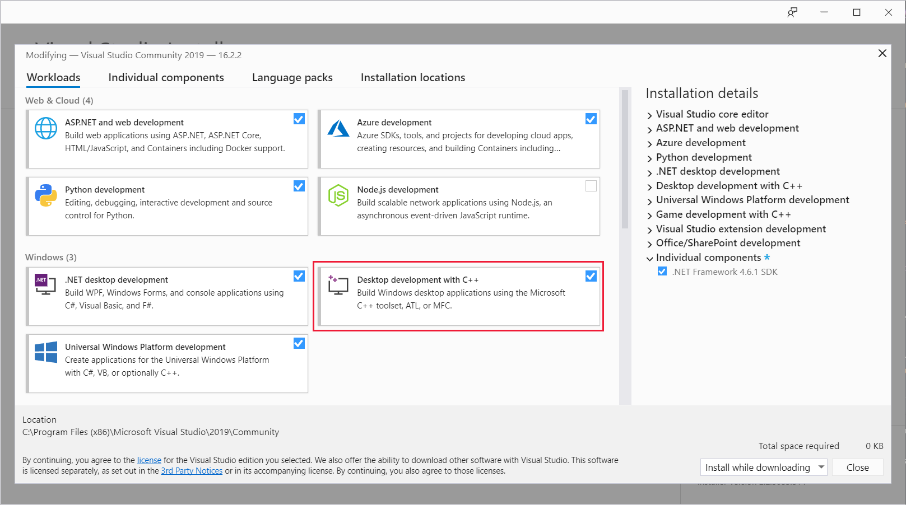

1. Start Visual Studio 2017.

1. Make sure the **Desktop development with C++** workload is available. Choose **Tools** > **Get Tools and Features** from the Visual Studio menu bar to open the Visual Studio installer. If this workload is already enabled, skip to the next step.

    

    Otherwise, check the box next to **Desktop development with C++**.

1. Make sure the **NuGet package manager** component is available. Switch to the **Individual components** tab of the Visual Studio installer dialog box, and select **NuGet package manager** if it is not already enabled.

      

1. If you needed to enable either the C++ workload or NuGet, select **Modify** (at the lower right corner of the dialog box). Installation of the new features takes a moment. If both features were already enabled, close the dialog box instead.

1. Create a new Visual C++ Windows Desktop Windows Console Application. First, choose **File** > **New** > **Project** from the menu. In the **New Project** dialog box, expand **Installed** > **Visual C++** > **Windows Desktop** in the left pane. Then select **Windows Console Application**. For the project name, enter *helloworld*.

    

1. If you're running 64-bit Windows, you may switch your build platform to `x64` by using the drop-down menu in the Visual Studio toolbar. (64-bit versions of Windows can run 32-bit applications, so this is not a requirement.)

    

1. In Solution Explorer, right-click the solution and choose **Manage NuGet Packages for Solution**.

    

1. In the upper-right corner, in the **Package Source** field, select **nuget.org**. Search for the `Microsoft.CognitiveServices.Speech` package, and install it into the **helloworld** project.

    

    > [!NOTE]
    > The current version of the Cognitive Services Speech SDK is `1.1.0`.

1. Accept the displayed license to begin installation of the NuGet package.

    

After the package is installed, a confirmation appears in the Package Manager console.
