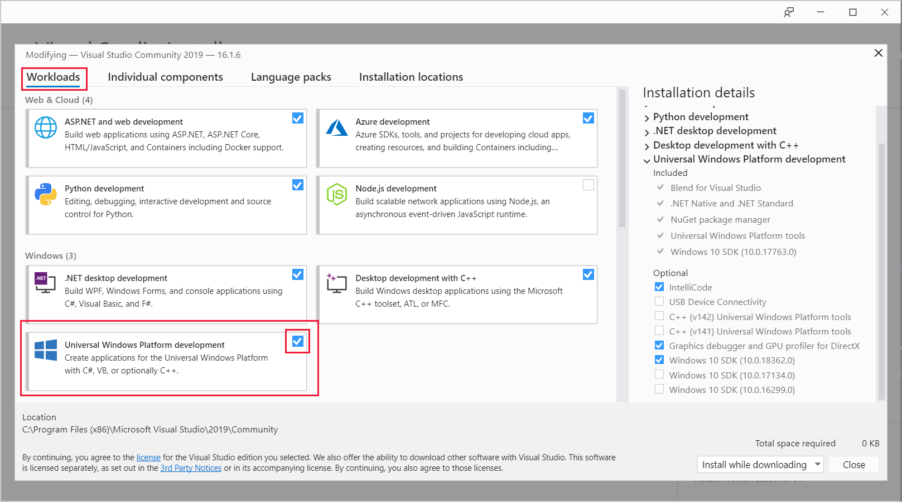
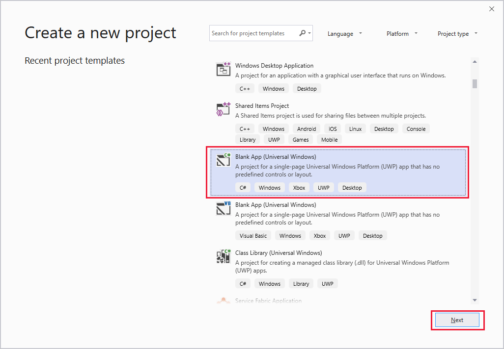
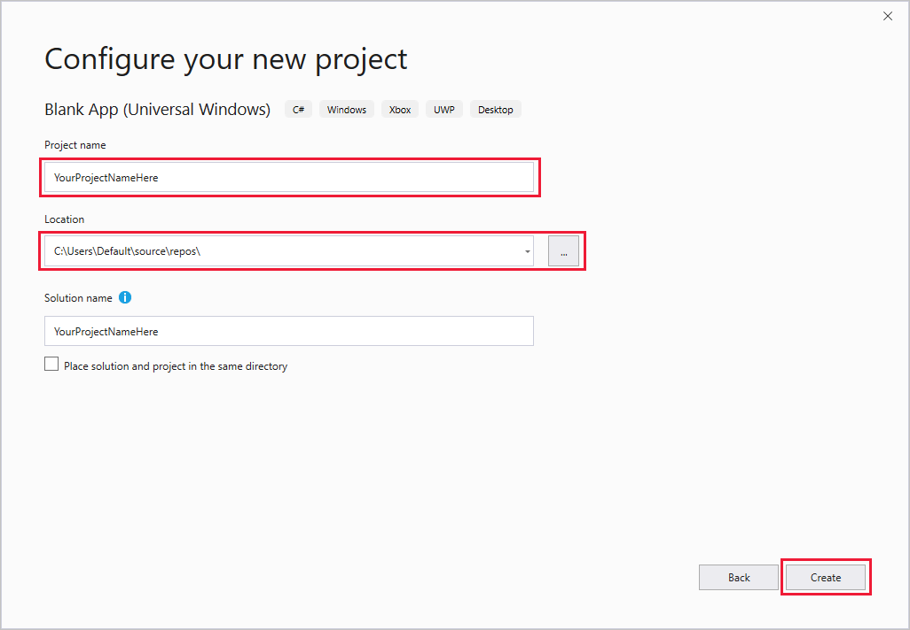
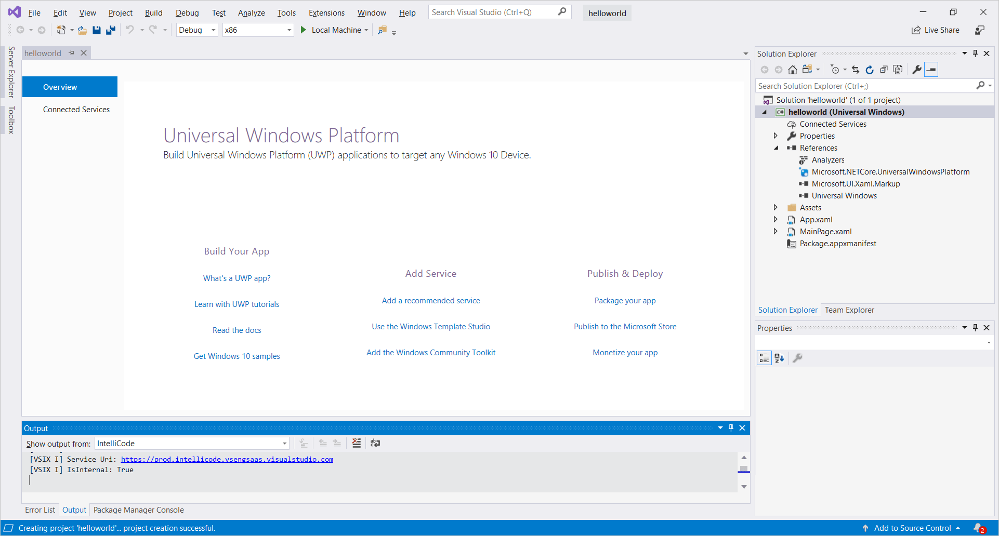
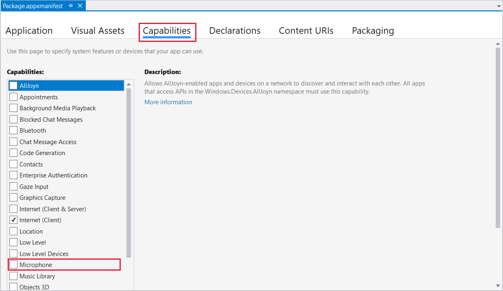

### Set up Visual Studio development options

To start, make sure you're set up correctly in Visual Studio for Universal Windows Platform (UWP) development:

1. Open Visual Studio 2019 to display the **Start** window.

   

1. Select **Continue without code** to go to the Visual Studio IDE.

1. From the Visual Studio menu bar, select **Tools** > **Get Tools and Features** to open Visual Studio Installer and view the **Modifying** dialog box.

   

1. In the **Workloads** tab, under **Windows**, find the **Universal Windows Platform development** workload. If the check box next to that workload is already selected, close the **Modifying** dialog box, and go to step 6.

1. Select the **Universal Windows Platform development** check box, select **Modify**, and then in the **Before we get started** dialog box, select **Continue** to install the UWP development workload. Installation of the new feature takes a moment.

1. Close Visual Studio Installer.

### Create the project and select the target architecture

Next, create your project:

1. In the Visual Studio menu bar, choose **File** > **New** > **Project** to display the **Create a new project** window.

   

1. Double-click **Blank App (Universal Windows)** to display the **Configure your new project** screen.

   

1. In **Project name**, enter `helloworld`.

1. In **Location**, navigate to and select or create the folder to save your project in.

1. Select **Create** to go to the **New Universal Windows Platform Project** window.

   

1. In **Minimum version** (the second drop-down box), choose **Windows 10 Fall Creators Update (10.0; Build 16299)**, which is the minimum requirement for the Speech SDK.

1. In **Target version** (the first drop-down box), choose this version or any later version.

1. Select **OK**.

You are returned to the Visual Studio IDE, with the new project created and visible in the **Solution Explorer** pane.

Now, select your target platform architecture. In the Visual Studio toolbar, find the **Solution Platforms** drop-down box. If you're running 64-bit Windows, choose **x64** in the drop-down box. 64-bit Windows can also run 32-bit applications, so you can choose **x86** if you prefer.

> [!NOTE]
> The Speech SDK only supports Intel-compatible processors. ARM processors are currently not supported.

### Set up audio capture

Then allow the project to capture audio input:

1. In **Solution Explorer**, double-click **Package.appxmanifest** to open the package application manifest.

1. Select the **Capabilities** tab.

   

1. Select the box for the **Microphone** capability.

1. Close and save your changes to the package application manifest.

### Install the Speech SDK

Finally, install the [Speech SDK NuGet package](https://aka.ms/csspeech/nuget), and reference the Speech SDK in your project:

1. In **Solution Explorer**, right-click your solution, and choose **Manage NuGet Packages for Solution** to go to the **NuGet - Solution** window.

1. Select **Browse**.

   

1. In **Package source**, choose **nuget.org**.

1. In the **Search** box, enter `Microsoft.CognitiveServices.Speech`, and then choose that package after it appears in the search results.

   

1. In the package status pane next to the search results, select your **helloworld** project.

1. Select **Install**.

1. In the **Preview Changes** dialog box, select **OK**.

1. In the **License Acceptance** dialog box, view the license, and then select **I Accept**. The package installation begins, and when installation is complete, the **Output** pane displays a message similar to the following text: `Successfully installed 'Microsoft.CognitiveServices.Speech 1.6.0' to helloworld`.
