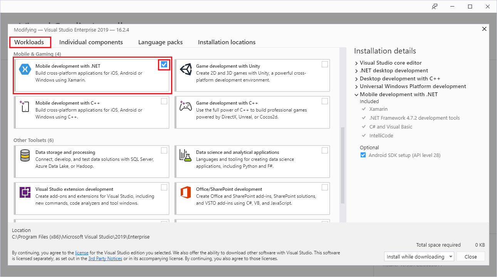
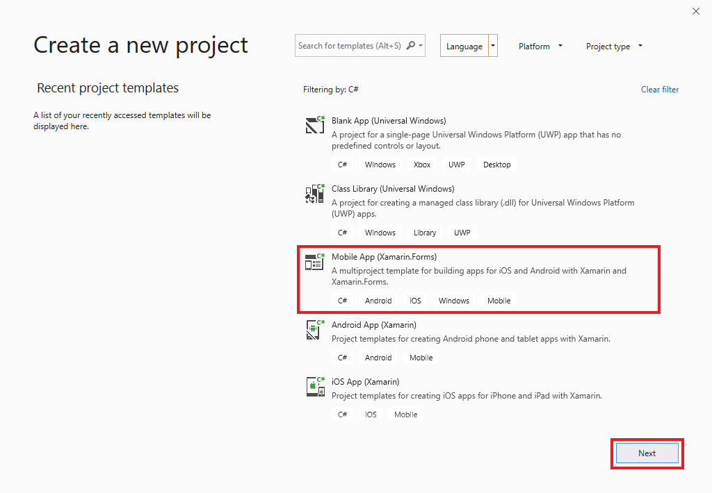
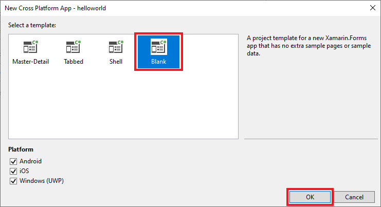
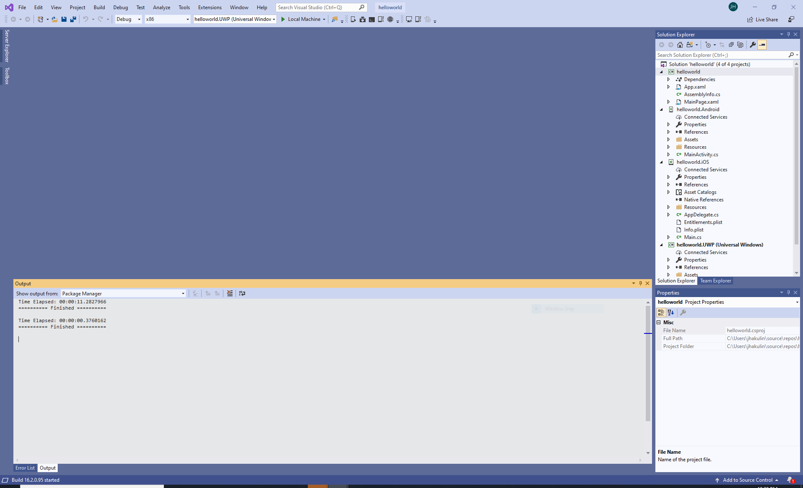
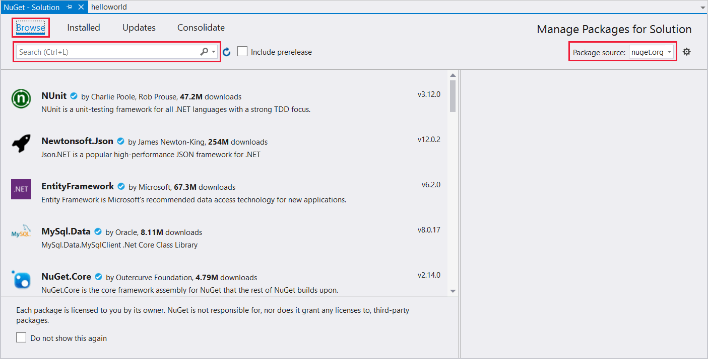

To create a Visual Studio project for cross-platform mobile app .NET development with Xamarin, you need to:
- Set up Visual Studio development options.
- Create the project. 
- Select the target architecture. 
- Install the Speech SDK.

### Set up Visual Studio development options

To start, make sure you're set up correctly in Visual Studio for cross-platform mobile development with .NET:

1. Open Visual Studio 2019.

1. From the Visual Studio menu bar, select **Tools** > **Get Tools and Features** to open Visual Studio Installer and view the **Modifying** dialog box.

   

1. On the **Workloads** tab, under **Windows**, find the **Mobile development with .NET** workload. If the check box next to that workload is already selected, close the **Modifying** dialog box, and go to step 5.

1. Select the **Mobile development with .NET** check box, select **Modify**, and then in the **Before we get started** dialog box, select **Continue** to install the mobile development with .NET workload. Installation of the new feature might take a while.

1. Close Visual Studio Installer.

### Create the project

1. On the Visual Studio menu bar, select **File** > **New** > **Project** to display the **Create a new project** window.

   

1. Find and select **Mobile App (Xamarin.Forms)**.

1. Select **Next** to display the **Configure your new project** screen.

   

1. In **Project name**, enter `helloworld`.

1. In **Location**, go to and select or create the folder to save your project in.

1. Select **Create** to go to the **New Mobile App Xamarin Forms Project** window.

   

1. Select the **Blank** template.

1. In **Platform**, select the boxes for **Android**, **iOS**, and **Windows (UWP)**.

1. Select **OK**. You're returned to the Visual Studio IDE, with the new project created and visible in the **Solution Explorer** pane.

   

Now select your target platform architecture and startup project. On the Visual Studio toolbar, find the **Solution Platforms** drop-down box. (If you don't see it, select **View** > **Toolbars** > **Standard** to display the toolbar that contains **Solution Platforms**.) If you're running 64-bit Windows, select **x64** in the drop-down box. You can select **x86** if you prefer because 64-bit Windows also can run 32-bit applications. In the **Start-up Projects** drop-down box, set **helloworld.UWP (Universal Windows)**.

### Install the Speech SDK

Install the [Speech SDK NuGet package](https://aka.ms/csspeech/nuget), and reference the Speech SDK in your project.

1. In **Solution Explorer**, right-click your solution. Select **Manage NuGet Packages for Solution** to go to the **NuGet - Solution** window.

1. Select **Browse**.

   

1. In **Package source**, select nuget.org.

1. In the **Search** box, enter `Microsoft.CognitiveServices.Speech`. Then select that package after it appears in the search results.

   

   > [!NOTE] The iOS library inside Microsoft.CognitiveServices.Speech nuget doesn't have bitcode enabled. If you need the bitcode library enabled for your application, use Microsoft.CognitiveServices.Speech.Xamarin.iOS nuget for the iOS project specifically.

1. In the package status pane next to the search results, select all projects: **helloworld**, **helloworld.Android**, **helloworld.iOS**, and **helloworld.UWP**.

1. Select **Install**.

1. In the **Preview Changes** dialog box, select **OK**.

1. In the **License Acceptance** dialog box, view the license, and then select **I Accept**. Install the Speech SDK package reference to all projects. After installation is completed successfully, you might see the following warning for helloworld.iOS. This is a known issue and should not affect your app functionality.

   > Could not resolve reference "C:\Users\Default\.nuget\packages\microsoft.cognitiveservices.speech\1.7.0\build\Xamarin.iOS\libMicrosoft.CognitiveServices.Speech.core.a". If this reference is required by your code, you may get compilation errors.
