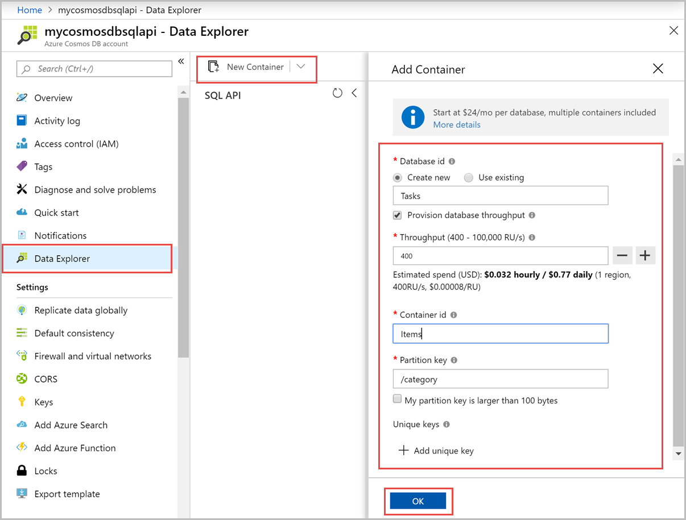

You can now use the Data Explorer tool in the Azure portal to create a database and collection. 

1. Click **Data Explorer** > **New Collection**. 
    
    The **Add Collection** area is displayed on the far right, you may need to scroll right to see it.

    

2. In the **Add collection** page, enter the settings for the new collection.

    Setting|Suggested value|Description
    ---|---|---
    Database id|Tasks|Enter *Tasks* as the name for the new database. Database names must contain from 1 through 255 characters, and they cannot contain /, \\, #, ?, or a trailing space.
    Collection id|Items|Enter *Items* as the name for your new collection. Collection ids have the same character requirements as database names.
    Provision database throughput|Leave blank|Azure Cosmos DB can provision throughput at either the database level (all collections in a database share the same throughput) or at the collection level. Leave blank to provision throughput at the collection level for this particular collection.
    Storage capacity| Unlimited|Choose the Storage capacity of **Unlimited**. 
    Partition key|/category|Enter "/category" as the partition key. Setting a partition key allows Azure Cosmos DB to scale your collection to meet the storage and throughput needs of your application. In general, a good choice of partition key is one that has a wide range of distinct values, and results in an even distribution of storage and request volume across your workload. [Learn more about partitioning.](../articles/cosmos-db/partitioning-overview.md)
    Throughput|400 RU|Change the throughput to 400 request units per second (RU/s). If you want to reduce latency, you can scale up the throughput later. 
    
    In addition to the preceding settings, you can optionally add **Unique keys** for the collection. Let's leave the field empty in this example. Unique keys provide developers with the ability to add a layer of data integrity to the database. By creating a unique key policy while creating a collection, you ensure the uniqueness of one or more values per partition key. To learn more, refer to the [Unique keys in Azure Cosmos DB](../articles/cosmos-db/unique-keys.md) article.
    
    Click **OK**.

    Data Explorer displays the new database and collection.

    