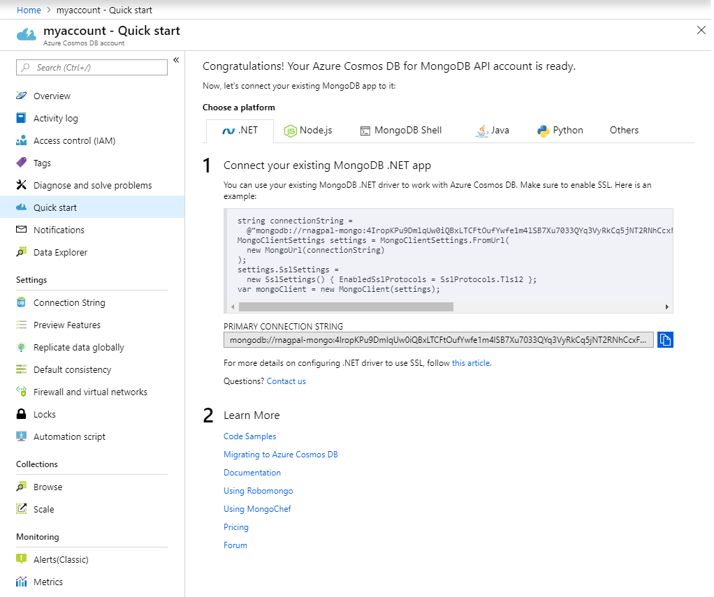

1. In a new window, sign in to the [Azure portal](https://portal.azure.com/).
2. In the left menu, click **Create a resource**, click **Databases**, and then under **Azure Cosmos DB**, click **Create**.
   
   

3. In the **New account** blade, specify **MongoDB** as the API and fill out your desired configuration for the Azure Cosmos DB account.
 
    * **ID** must be a unique name you wish to use to identify your Azure Cosmos DB account. It may only contain lower case letters, numbers, the '-' character, and must be between 3 and 50 characters.
    * **Subscription** is your Azure subscription. It will be filled out for you.
    * **Resource Group** is the resource group name for your Azure Cosmos DB account. Select **Create New**, then enter a new resource-group name for your account. For simplicity, you can use the same name as your ID.
    * **Location** is the geographic location where your Azure Cosmos DB instance is located. Choose the location closest to your users.

    Then click **Create**.

    

4. The account creation takes a few minutes. Wait for the portal to display the **Congratulations! Your Azure Cosmos DB account with MongoDB API is ready** page.

    
