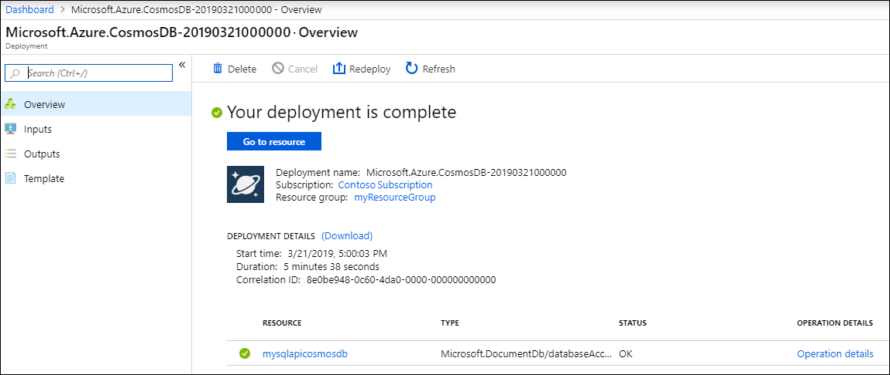

1. In a new browser window, sign in to the [Azure portal](https://portal.azure.com/).
2. Select **Create a resource** > **Databases** > **Azure Cosmos DB**.
   
   

3. On the **Create Azure Cosmos Account** page, enter the basic settings for the new Azure Cosmos account. 
 
    Setting|Value|Description
    ---|---|---
    Subscription|Your subscription|Select the Azure subscription that you want to use for this Azure Cosmos account. 
    Resource Group|Create new  Then enter the same unique name as provided in ID|Select **Create new**. Then enter a new resource-group name for your account. For simplicity, use the same name as your ID. 
    Account Name|Enter a unique name|Enter a unique name to identify your Azure Cosmos account. Because *documents.azure.com* is appended to the ID that you provide to create your URI, use a unique ID.  The ID can only contain lowercase letters, numbers, and the hyphen (-) character. It must be between 3-31 characters in length. 
    API|Core (SQL)|The API determines the type of account to create. Azure Cosmos DB provides the following APIs: SQL (Core) for document data, Gremlin for graph, MongoDB for document data, Table, and Cassandra. Currently, you must create a separate account for each API.   Select **SQL (Core)**, because in this article you create a document database and query it using SQL syntax.   [Learn more about the SQL API](../articles/cosmos-db/documentdb-introduction.md).|
    Location|Select the region closest to your users|Select a geographic location to host your Azure Cosmos account. Use the location that is the closest to your users to give them the fastest access to the data.

    Select **Review+Create**. You can skip the **Network** and **Tags** section. 

    

4. The account creation takes a few minutes. Wait for the portal to display the **Congratulations! Your Azure Cosmos DB account was created** page.

    

