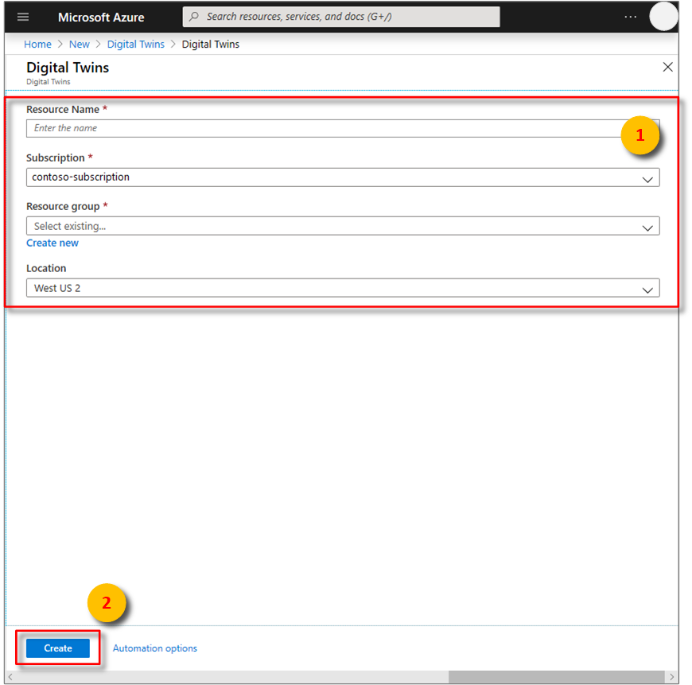

1. Sign in to the [Azure portal](http://portal.azure.com).

1. Select **Create a resource** > **Internet of Things** > **Digital Twins**. 

    

1. In the **Digital Twins** pane, enter the following information:
   * **Subscription**: Choose the subscription that you want to use to create this Digital Twins instance. 
   * **Resource group**: Select or create a resource group for the Digital Twins instance. For more information on resource groups, see [Use resource groups to manage your Azure resources][lnk-resource-groups].
   * **Location**: Select the closest location to your devices.
   * **Name**: Create a unique name for your Digital Twins.

   

1. Review your Digital Twins information, then click **Create**. Your Digital Twins might take a few minutes to create. You can monitor the progress in the **Notifications** pane.

1. Digital Twins provides a collection of REST APIs for management and interaction with your topology. These APIs are called Management APIs. The URL is generated in portal in **Overview** section and has the following format `https://yourDigitalTwinsName.yourLocation.azuresmartspaces.net/management/swagger`. Note down this URL; you will need this in the proceeding steps.
