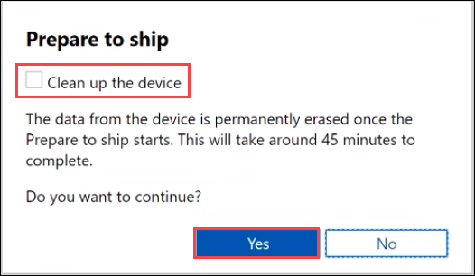

Final step is to prepare the device to ship. In this step, all the device shares are taken offline. The shares cannot be accessed once you start this process. You can also choose to clean up device whereby the local data on the device is erased permanently. Once the step is complete, your e-ink display will show the return shipping label.

> [!IMPORTANT]
> - You can choose to erase the data on the device permanently in this step and clean up the device. The data in your Azure Storage account will stay and accrue charges. We recommend that you delete this data only after you have verified that data copy to an on-premises data server is complete.

1. Go to **Prepare to ship** and select **Start preparation**. 
   
    

 
2. The prepare to ship starts and the device shares go offline. By default, the device clean up is performed and Data Box erases the data on its disks. 

    

    You can opt out of the cleanup procedure by unchecking the combo box. In this case, the device data is erased later at the datacenter.

    

3. Once the **Prepare to ship** completes, you see a reminder to download the shipping label.

    

4. The device status updates to *Ready to ship* and the device is locked.
        
    

5. Shut down the device. Go to **Shut down or restart** page and select **Shut down**. When prompted for confirmation, select **OK** to continue.

6. Remove the cables. The next step is to ship the device to Microsoft.
