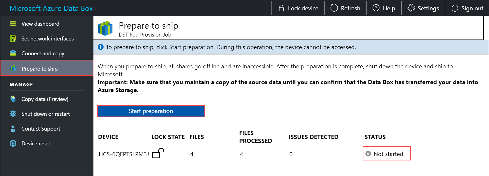
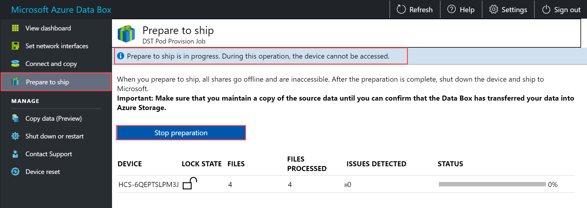
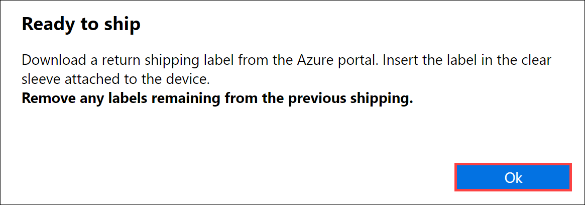
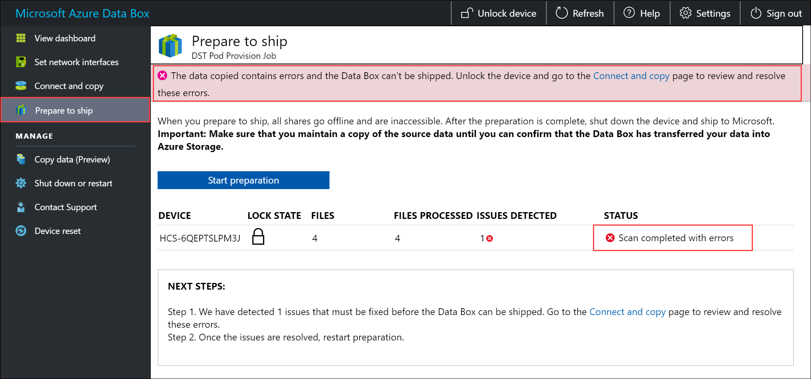

Final step is to prepare the device to ship. In this step, all the device shares are taken offline. The shares cannot be accessed once you start this process.

> [!IMPORTANT]
> Prepare to ship is required as it flags data that does not conform to Azure naming conventions. Skipping this step could result in potential data upload failures due to non-confirming data.

1. Go to **Prepare to ship** and click **Start preparation**. By default, checksums are computed inline during the prepare to ship. The checksum computation can take hours to days depending upon the size of your data. 
   
    

    If for any reason you want to stop the device preparation, click **Stop preparation**. You can resume the prepare to ship later.
        
    
    
2. The prepare to ship starts and the device shares go offline. You see a reminder to download the shipping label once the device is ready.

    

3. The device status updates to *Ready to ship* and the device is locked once the device preparation is complete.
        
    

    If you want to copy more data to the device, you can unlock the device, copy more data, and run prepare to ship again. 

    If there are errors in this step, you will need to download the error log and resolve the errors. Once the errors are resolved, you will need to run the prepare to ship again.

4. After the prepare to ship is successfully complete (with no errors), download the list of files (also known as the manifest) copied in this process. You can later use this list to verify the files uploaded to Azure.
        
    

5. Shut down the device. Go to **Shut down or restart** page and click **Shut down**. When prompted for confirmation, click **OK** to continue.

6. Remove the cables. The next step is to ship the device to Microsoft.
