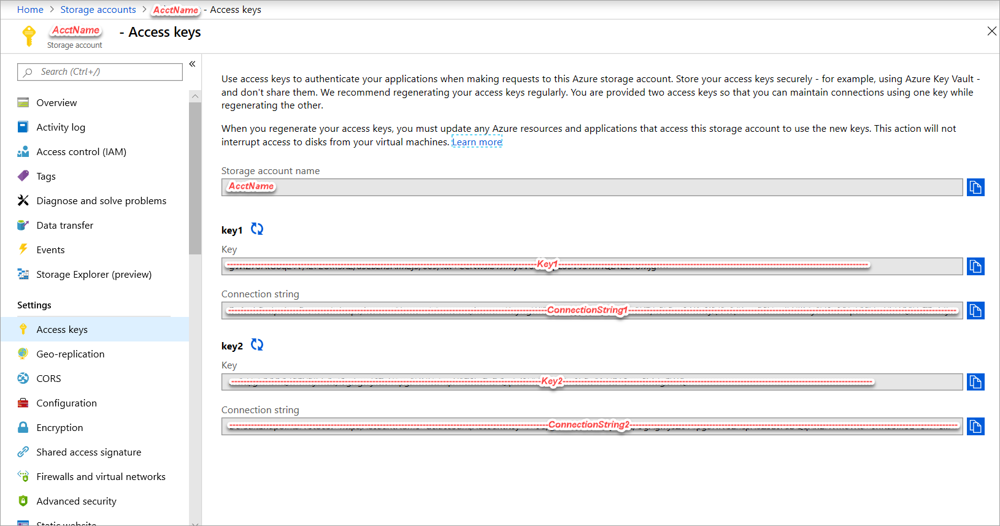
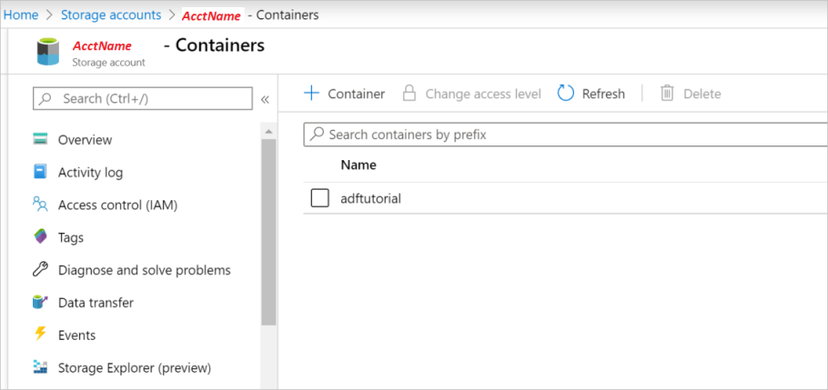
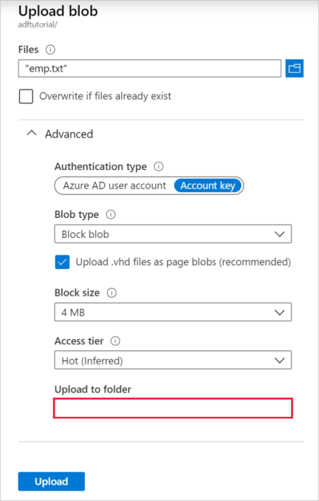

## Prerequisites

### Azure subscription
If you don't have an Azure subscription, create a [free account](https://azure.microsoft.com/free/) before you begin.

### Azure roles
To create Data Factory instances, the user account that you use to sign in to Azure must be a member of the *contributor* or *owner* role, or an *administrator* of the Azure subscription. To view the permissions that you have in the subscription, go to the [Azure portal](https://portal.azure.com), select your username in the upper-right corner, select **More options** (...), and then select **My permissions**. If you have access to multiple subscriptions, select the appropriate subscription.

To create and manage child resources for Data Factory - including datasets, linked services, pipelines, triggers, and integration runtimes - the following requirements are applicable:

- To create and manage child resources in the Azure portal, you must belong to the **Data Factory Contributor** role at the resource group level or above.
- To create and manage child resources with PowerShell or the SDK, the **contributor** role at the resource level or above is sufficient.

For sample instructions about how to add a user to a role, see the [Add roles](../articles/billing/billing-add-change-azure-subscription-administrator.md) article.

For more info, see the following articles:

- [Data Factory Contributor role](../articles/role-based-access-control/built-in-roles.md#data-factory-contributor)
- [Roles and permissions for Azure Data Factory](../articles/data-factory/concepts-roles-permissions.md)

### Azure storage account
You use a general-purpose Azure storage account (specifically Blob storage) as both *source* and *destination* data stores in this quickstart. If you don't have a general-purpose Azure storage account, see [Create a storage account](../articles/storage/common/storage-quickstart-create-account.md) to create one. 

#### Get the storage account name and account key
You will need the name and key of your Azure storage account for this quickstart. The following procedure provides steps to get the name and key of your storage account: 

1. In a web browser, go to the [Azure portal](https://portal.azure.com) and sign in using your Azure username and password.
2. Select **All services** > **Storage** > **Storage accounts**.
3. In the **Storage accounts** page, filter for your storage account (if needed), and then select your storage account. 
4. From the *\<Account name>* - **Storage account** page's sidebar, go to the **Settings** label and select **Access keys**. The *\<Account name>* - **Access keys** appears.

   
5. Copy the values for the **Storage account name** and **key1** boxes to the clipboard. Paste them into Notepad or any other editor and save it. You use them later in this quickstart.   

#### Create a blob container
In this section, you create a blob container named **adftutorial** in Azure Blob storage.

1. From the *\<Account name>* - **Access keys** page's sidebar, select **Overview** > **Blobs**.
2. On the *\<Account name>* - **Blobs** page's toolbar, select **Container**.
3. In the **New container** dialog box, enter **adftutorial** for the name, and then select **OK**. The *\<Account name>* - **Blobs** page is updated to include **adftutorial** in the list of containers.

   

#### Add an input folder and file for the blob container
In this section, you create a folder named **input** in the container you just created, and then upload a sample file to the input folder.

1. In the *\<Account name>* - **Blobs** page, select **adftutorial** from the updated list of containers. 
2. On the **adftutorial** container page's toolbar, select **Upload**.
3. On the **Upload blob** page, expand the **Advanced** heading.

   
4. In a text editor such as **Notepad**, create a file named **emp.txt** with the following content. Save it in the **C:\ADFv2QuickStartPSH** folder. Create the **ADFv2QuickStartPSH** folder if it does not already exist.
    
   ```
   John, Doe
   Jane, Doe
   ```    
5. In the Azure portal's **Upload blob** page, select the **Files** box, and then browse to and select the **emp.txt** file.
6. In the **Upload to folder** box, enter **input**.
7. Select **Upload**. You should see the **emp.txt** file and the status of the upload in the list.
8. Select the **Close** icon (an **X**) to close the **Upload blob** page.

Keep the **adftutorial** container page open. You use it to verify the output at the end of this quickstart.