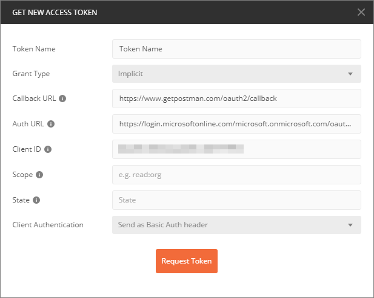

## Setup and test with the Postman client

Get started quickly by using a REST client tool such as [Postman](https://www.getpostman.com/) to prepare your local testing environment. The Postman client helps to quickly create complex HTTP requests.

Configure your app to allow OAuth 2.0 authenticated requests in Azure Active Directory.

1. Follow the steps in [this quickstart](https://docs.microsoft.com/azure/active-directory/develop/quickstart-v1-integrate-apps-with-azure-ad) to create an Azure AD application. Or you can reuse an existing registration. 
1. Under **Required permissions**, enter “Azure Digital Twins” and select **Delegated Permissions**. Then select **Grant Permissions**.

    

1. Click **Manifest** to open the application manifest for your app. Set *oauth2AllowImplicitFlow* to `true`.

    

1. Configure a reply url to [`https://www.getpostman.com/oauth2/callback`](https://www.getpostman.com/oauth2/callback).

      

Next, set up and configure Postman to obtain an Azure Active Directory token. Afterwards, make an authenticated HTTP request to Azure Digital Twins using the acquired token:

1. Go to https://www.getpostman.com/ to download the app.
1. Select the **Authorization** tab, select **OAuth 2.0**, and then select **Get New Access Token**.

    |**Field**  |**Value** |
    |---------|---------|
    | *Grant Type* | `Implicit` |
    | *Callback URL* | [`https://www.getpostman.com/oauth2/callback`](https://www.getpostman.com/oauth2/callback) |
    | *Auth URL* | https://login.microsoftonline.com/yourAzureTenant.onmicrosoft.com/oauth2/authorize?resource=0b07f429-9f4b-4714-9392-cc5e8e80c8b0 |
    | *Client ID* | Use the Application ID for the Azure AD app that was created or repurposed from Step 2 |
    | *Scope* | leave blank |
    | *State* | leave blank |
    | *Client Authentication* | `Send as Basic Auth header` |

1. The client should now look like:

   

1. Click **Request Token**.

    >[!NOTE]
    >If you receive error message "OAuth 2 couldn’t be completed," try the following:
    > * Close Postman and reopen it and try again.

1. Scroll down, and select **Use Token**.