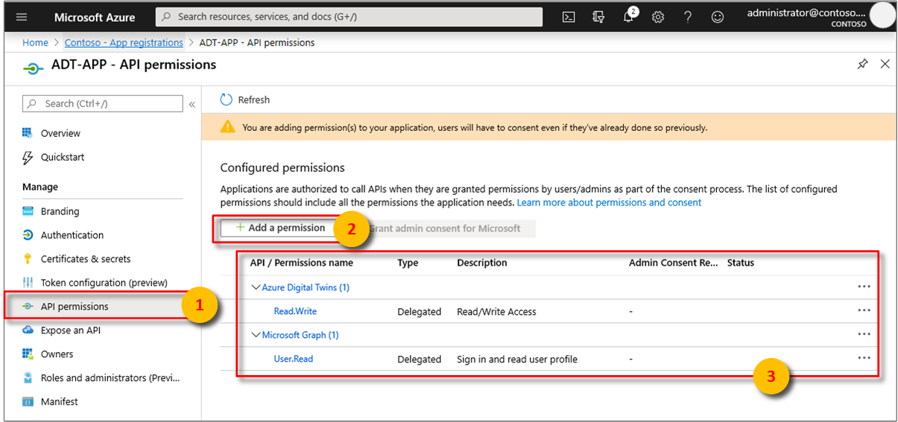

>[!NOTE]
>This section provides instructions for the [new Azure AD app registration](https://docs.microsoft.com/azure/active-directory/develop/quickstart-register-app). If you still have legacy native app registration, you may use it as long as it's supported. Additionally, if for some reason the new way of app registation is not working in your setup, you may try to create a legacy native AAD app. Read [Register your Azure Digital Twins app with Azure Active Directory legacy](../articles/digital-twins/how-to-use-legacy-aad.md) for more instructions. 

1. In the [Azure portal](https://portal.azure.com), open **Azure Active Directory** from the left pane, and then open the **App registrations** pane. Select the **New registration** button.

    

1. Give a friendly name for this app registration in the **Name** box. Under the **Redirect URI (optional)** section, choose **Public client (mobile & desktop)** in the drop-down on the left, and enter `https://microsoft.com` in the textbox on the right. Select **Register**.

    

1. To make sure that [the app is registered as a *native app*](https://docs.microsoft.com/azure/active-directory/develop/scenario-desktop-app-registration), open the **Authentication** pane for your app registration, and scroll down in that pane. In the **Default client type** section, choose **Yes** for **Treat application as a public client**. 

    

1.  Open the **Overview** pane of your registered app, and copy the values of following entities to a temporary file. You'll use these values to configure your sample application in the following sections.

    - **Application (client) ID**
    - **Directory (tenant) ID**

    

1. Open the **API permissions** pane for your app registration. Select **Add a permission** button. In the **Request API permissions** pane, select the **APIs my organization uses** tab, and then search for:
    
    1. **Azure Digital Twins**. Select the **Azure Digital Twins** API.

        

    1. Alternatively, search for **Azure Smart Spaces**. Select the **Azure Smart Spaces Service** API.

        

    > [!NOTE]
    > The exact name that will appear when searched may vary depending on which Azure tenant you belong to.

1. The selected API shows up as **Azure Digital Twins** in the same **Request API permissions** pane. Select the **Read (1)** drop down, and then select **Read.Write** checkbox. Select the **Add permissions** button.

    

1. Depending on your organization's settings, you might need to take additional steps to grant admin access to this API. Contact your administrator for more information. Once the admin access is approved, the **ADMIN CONSENT REQUIRED** column in the **API permissions** pane will show similar to the following for your APIs:

    

