# Use Azure Storage Explorer to manage Azure managed disks

Storage Explorer 1.10.0 enables users to upload, download, and copy managed disks, as well as create snapshots. Because of these additional capabilities, you can use Storage Explorer to migrate data from on-premises to Azure, as well as across Azure regions.

## Pre-requisites

To complete this article, you'll need the following:
- An Azure subscription
- One or more Azure managed disks
- The latest version of [Azure Storage Explorer](https://azure.microsoft.com/features/storage-explorer/).

## Connect to an Azure subscription

If your Storage Explorer isn't connected to Azure, you will not be able to use it to manage resources. This section goes over connecting it to your Azure account so that you can manage resources using Storage Explorer.

1. Launch Azure Storage Explorer and click the **plug-in** icon on the left.

    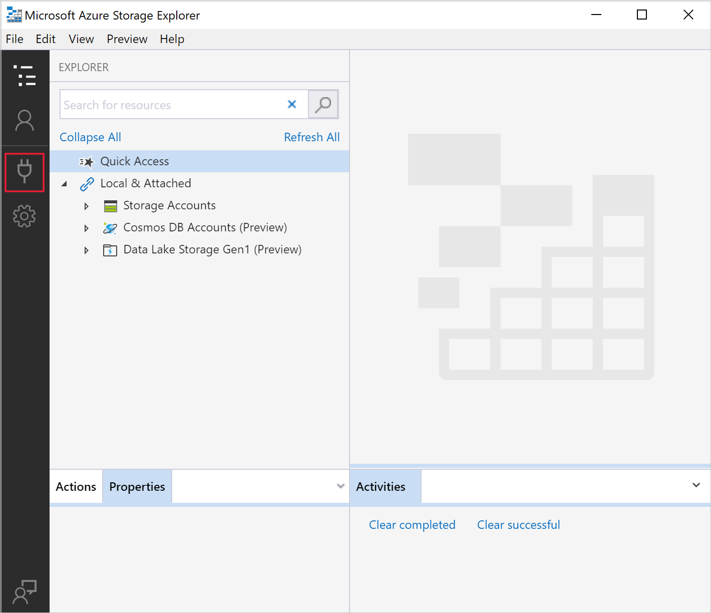

1. Select **Add an Azure Account**, and then click **Next**.

    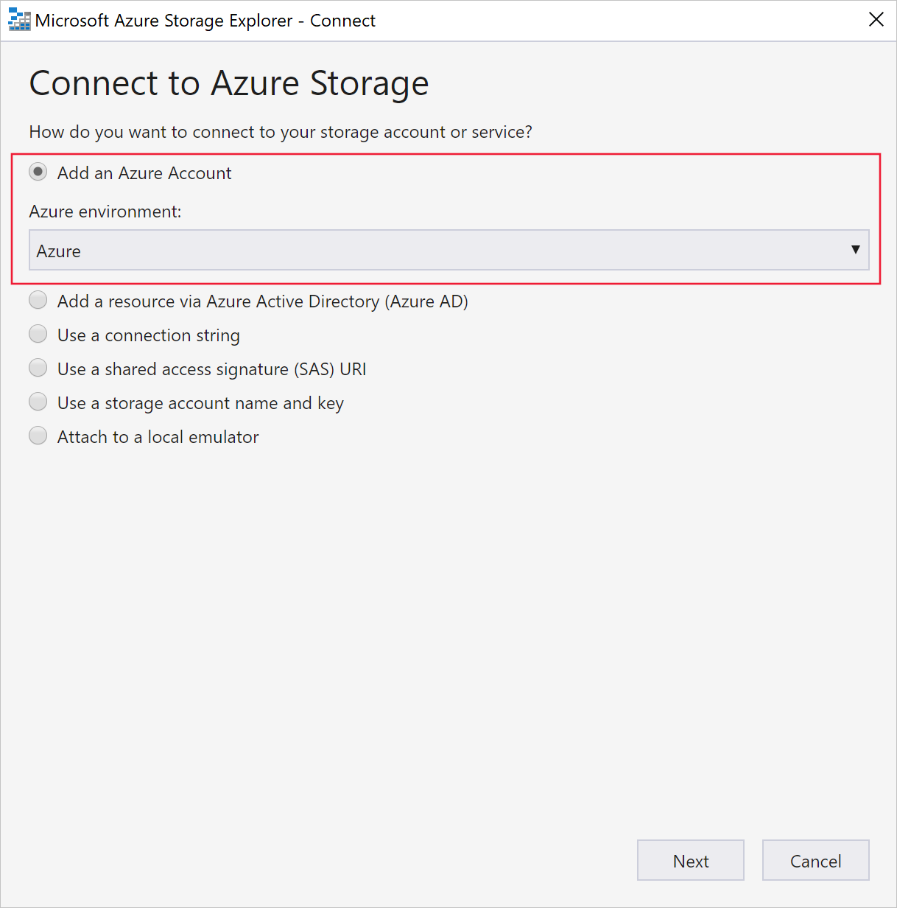

1. In the **Azure Sign in** dialog box, enter your Azure credentials.

    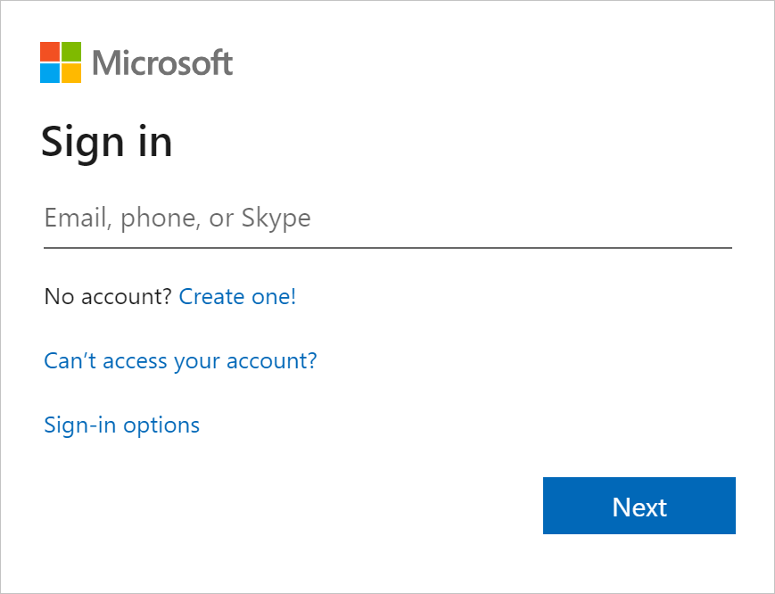

1. Select your subscription from the list and then click **Apply**.

    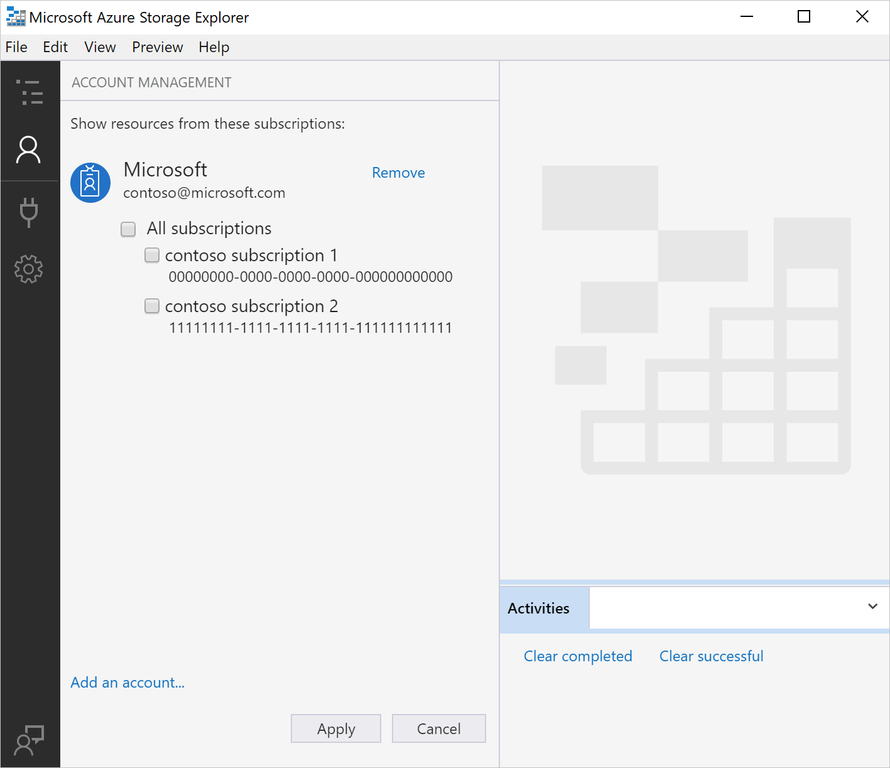

## Upload a managed disk from an on-prem VHD

1. On the left pane, expand **Disks** and select the resource group that you want to upload your disk to.

    

1. Select **Upload**.

    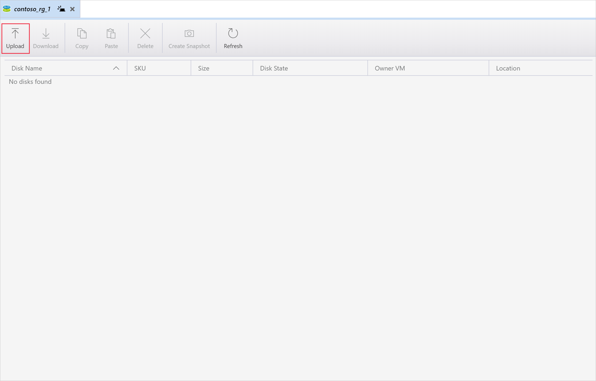

1. In **Upload VHD** specify your source VHD, the name of the disk, the OS type, the region you want to upload the disk to, as well as the account type. In some regions Availability zones are supported, for those regions you can select a zone of your choice.
1. Select **Create** to begin uploading your disk.

    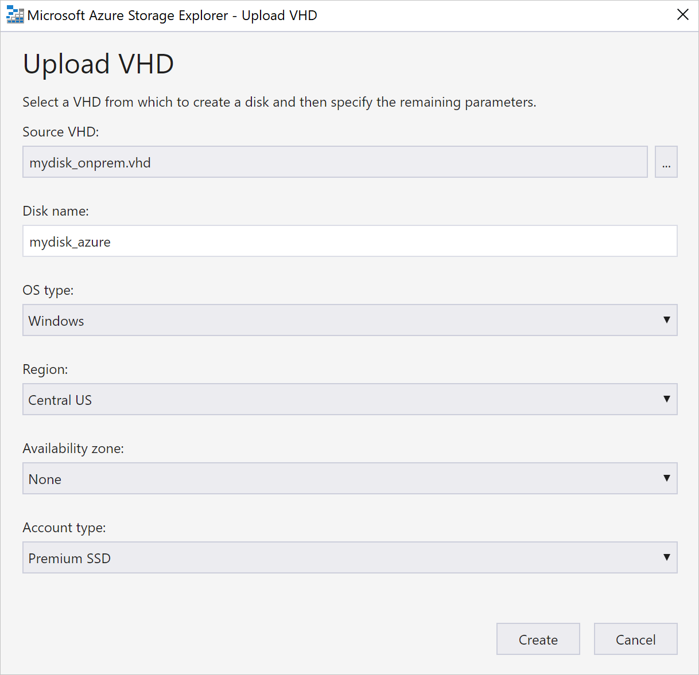

1. The status of the upload will now display in **Activities**.

    

1. If the upload has finished and you don't see the disk in the right pane, select **Refresh**.

## Download a managed disk

The following steps explain how to download a managed disk to an on-prem VHD. A disk's state must be **Unattached** in order to be downloaded, you cannot download an **Attached** disk.

1. On the left pane, if it isn't already expanded, expand **Disks** and select the resource group that you want to download your disk from.

    

1. On the right pane, select the disk you want to download.
1. Select **Download** and then choose where you would like to save the disk.

    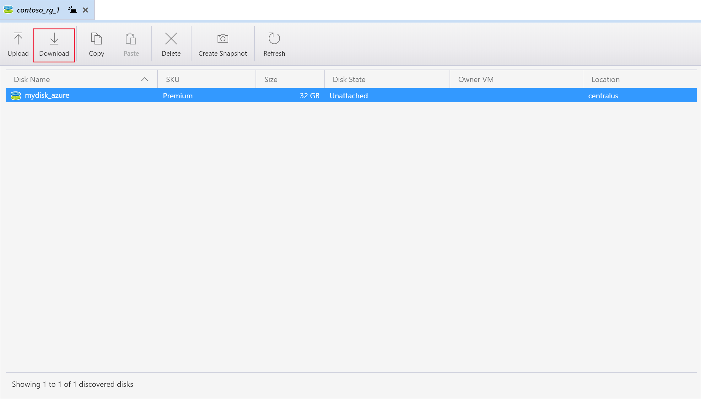

1. Select **Save** and your disk will begin downloading. The status of the download will display in **Activities**.

    

## Copy a managed disk

With Storage Explorer, you can copy a manged disk within or across regions. To copy a disk:

1. From the **Disks** dropdown on the left, select the resource group that contains the disk you want to copy.

    

1. On the right pane, select the disk you'd like to copy and select **Copy**.

    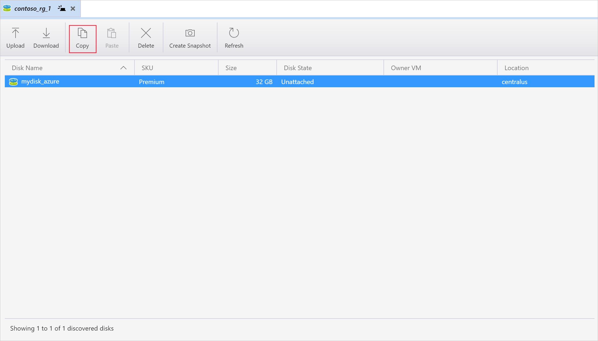

1. On the left pane, select the resource group you'd like to paste the disk in.

    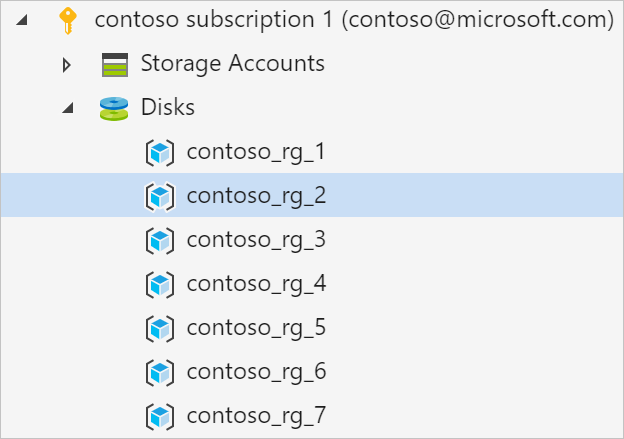

1. Select **Paste** on the right pane.

    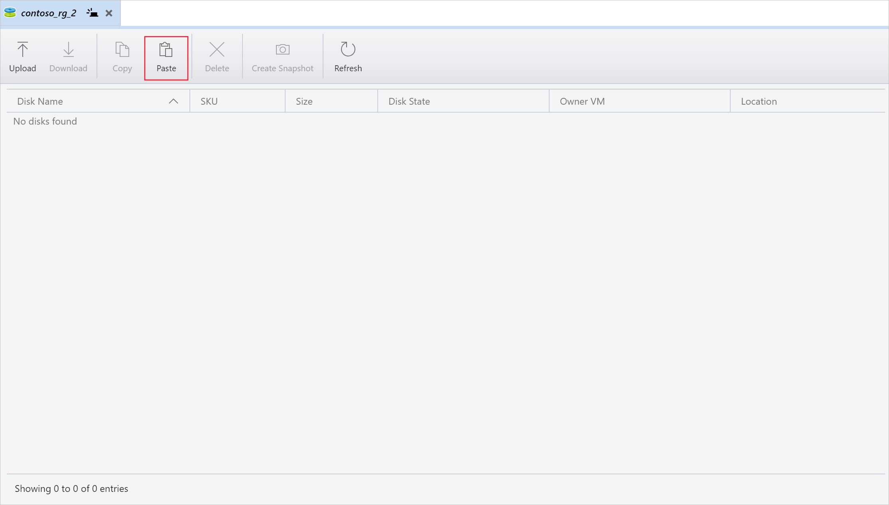

1. In the **Paste Disk** dialog, fill in the values. You can also specify an Availability zone in supported regions.

    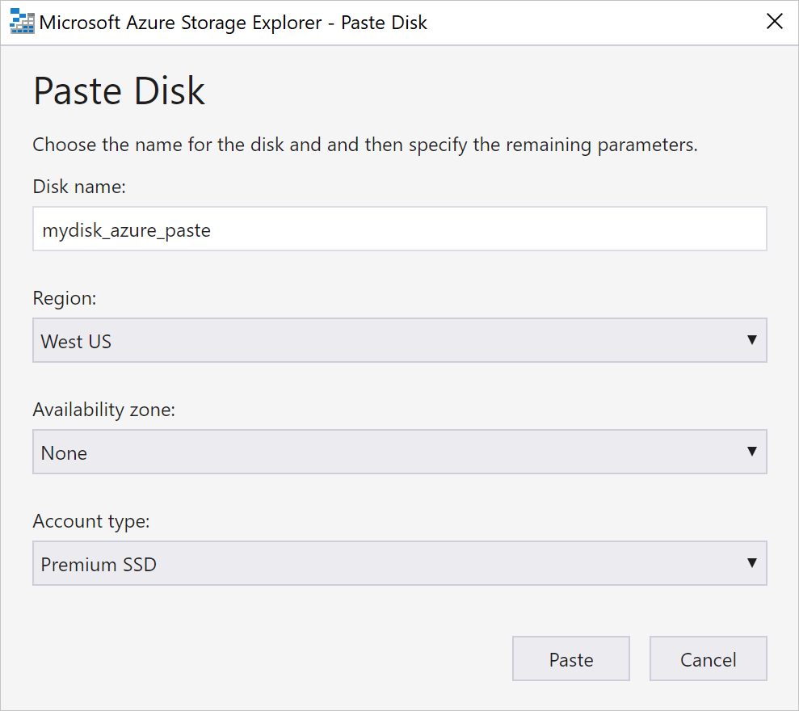

1. Select **Paste** and your disk will begin copying, the status is displayed in **Activities**.

    

## Create a snapshot

1. From the **Disks** dropdown on the left, select the resource group that contains the disk you want to copy.

    

1. On the right, select the disk you'd like to snapshot and select **Create Snapshot**.

    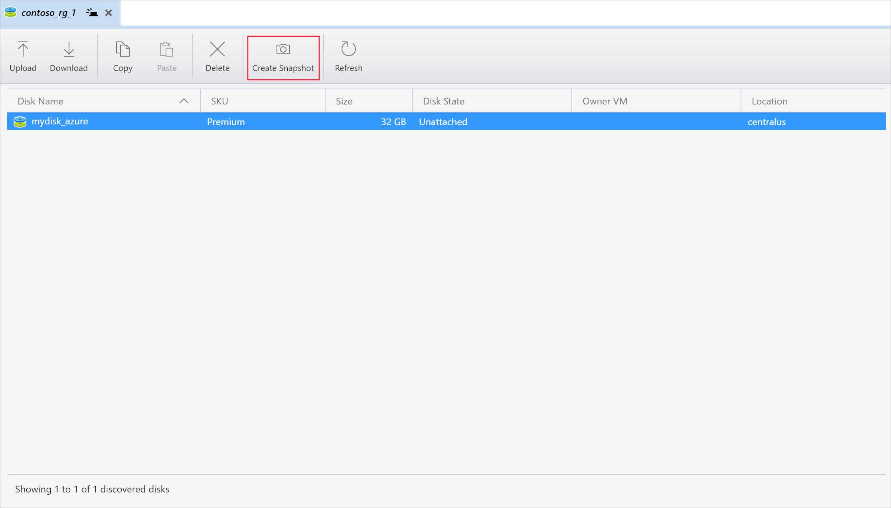

1. In **Create Snapshot**, specify the name of the snapshot as well as the resource group you want to create it in. Then select **Create**.

    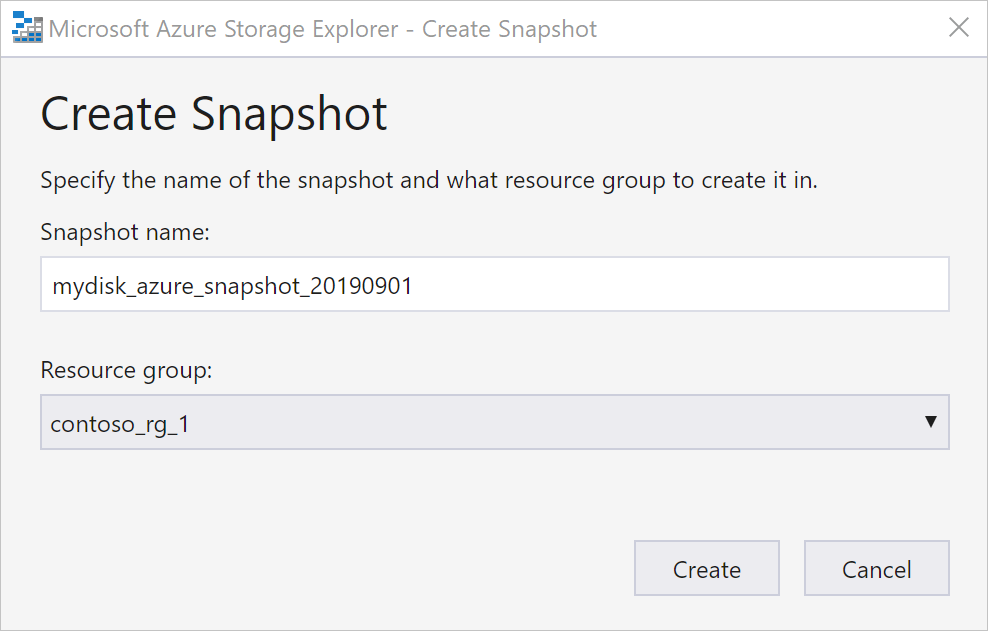

1. Once the snapshot has been created, you can select **Open in Portal** in **Activities** to view the snapshot in the Azure Portal.

    

## Next steps