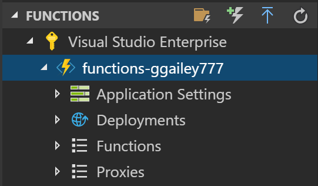

## Publish the project to Azure

Visual Studio Code lets you publish your functions project directly to Azure. In the process, you create a function app and related resources in your Azure subscription. The function app provides an execution context for your functions. The project is packaged and deployed to the new function app in your Azure subscription.

This article assumes that you are creating a new function app. Publishing to an existing function app overwrites the content of that app in Azure.

1. In the **Azure: Functions** area, select the Deploy to Function App icon.

    

1. If not signed-in, you are prompted to **Sign in to Azure**. You can also **Create a free Azure account**. After successful sign in from the browser, go back to Visual Studio Code. 

1. If you have multiple subscriptions, **Select a subscription** for the function app, then choose **+ Create New Function App in Azure**.

1. Type a globally unique name that identifies your function app and press Enter. Valid characters for a function app name are `a-z`, `0-9`, and `-`.

1. Choose **+ Create New Resource Group**, type a resource group name, like `myResourceGroup`, and press enter. You can also use an existing resource group.

1. Choose **+ Create New Storage Account**, type a globally unique name of the new storage account used by your function app and press Enter. Storage account names must be between 3 and 24 characters in length and may contain numbers and lowercase letters only. You can also use an existing account.

1. Choose a location in a [region](https://azure.microsoft.com/regions/) near you or near other services your functions access.

    When you press Enter, the following Azure resources are created in your subscription:

    * **[Resource group](../articles/azure-resource-manager/resource-group-overview.md)**: Contains all of the created Azure resources. The name is based on your function app name.
    * **[Storage account](../articles/storage/common/storage-quickstart-create-account.md)**: 
    * **[Hosting plan](../articles/azure-functions/functions-scale.md)**: A consumption plan is created in the West US region to host your serverless function app.
    * **Function app**: Your project is uploaded to and runs in this new function app.  

    A notification is displayed after your function app is created and the deployment package is applied.

1. Select **View Output** in the notifications to view the creation and deployment results, including the Azure resources that you created.

    

1. Make a note of the HTTPTrigger URL of the new function app when running in Azure. You can use this URL to trigger your function running in Azure.

    

1. Back in the **Azure: Functions** area, you see the new function app displayed under your subscription. When you expand this node, you see the functions in the function app, as well as application settings and function proxies.

    

    From your function app node, type Ctrl and click (right-click) to choose to perform various management and configuration tasks against the function app in Azure. You can also choose to view the function app in the Azure portal.
