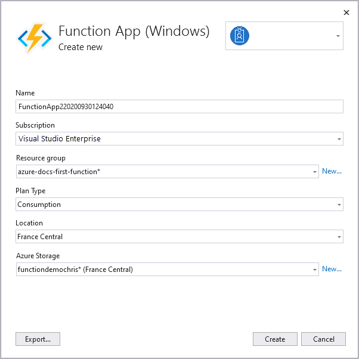
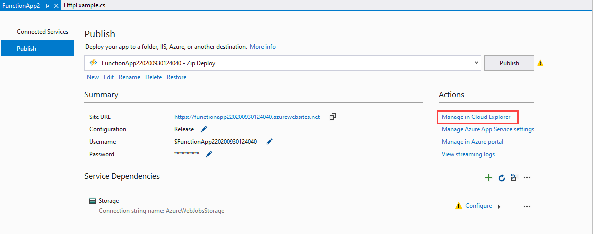

1. In **Solution Explorer**, right-click the project and select **Publish**.

2. In the **Pick a publish target** dialog, use the publish options as specified in the table below the image: 

    

    | Option      | Description                                |
    | ------------ |  -------------------------------------------------- |
    | **Azure Functions Consumption plan** |   When you publish your project to a function app that runs in a [Consumption plan](functions-scale.md#consumption-plan), you only pay for executions of your functions app. Other hosting plans incur higher costs. To learn more, see [Azure Functions scale and hosting](../articles/azure-functions/functions-scale.md). | 
    | **Create new** | A new function app, with related resources, is created in Azure. When you choose **Select Existing**, all files in the existing function app in Azure are overwritten by files from the local project. Only use this option when republishing updates to an existing function app. |
    | **Run from a package file** | Your function app is deployed using [Zip Deploy](../articles/azure-functions/functions-deployment-technologies.md#zip-deploy) with [Run-From-Package](../articles/azure-functions/run-functions-from-deployment-package.md) mode enabled. This is the recommended way of running your functions, which results in better performance. |

3. Select **Publish**. If you haven't already signed-in to your Azure account from Visual Studio, select **Sign-in**. You can also create a free Azure account.

4. In the **App Service: Create new** dialog, use the **Hosting** settings as specified in the table below the image:

    

    | Setting      | Suggested value  | Description                                |
    | ------------ |  ------- | -------------------------------------------------- |
    | **Name** | Globally unique name | Name that uniquely identifies your new function app. Valid characters are `a-z`, `0-9`, and `-`. |
    | **Subscription** | Choose your subscription | The Azure subscription to use. |
    | **[Resource Group](../articles/azure-resource-manager/resource-group-overview.md)** | myResourceGroup |  Name of the resource group in which to create your function app. Choose **New** to create a new resource group.|
    | **[Hosting Plan](../articles/azure-functions/functions-scale.md)** | Consumption plan | Make sure to choose the **Consumption** under **Size** after you select **New** to create a serverless plan. Also, choose a **Location** in a [region](https://azure.microsoft.com/regions/) near you or near other services your functions access. When you run in a plan other than **Consumption**, you must manage the [scaling of your function app](../articles/azure-functions/functions-scale.md).  |
    | **[Azure Storage](../articles/storage/common/storage-quickstart-create-account.md)** | General-purpose storage account | An Azure storage account is required by the Functions runtime. Select **New** to create a general-purpose storage account. You can also use an existing account that meets the [storage account requirements](../articles/azure-functions/functions-scale.md#storage-account-requirements).  |

5. Select **Create** to create a function app and related resources in Azure with these settings and deploy your function project code. 

6. After the deployment is complete, make a note of the **Site URL** value, which is the address of your function app in Azure.

    
