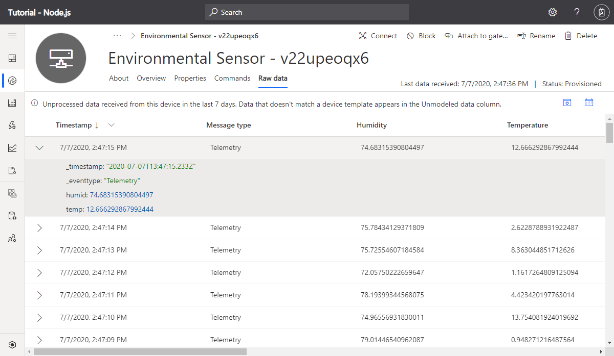

As an operator in your Azure IoT Central application, you can:

* View the telemetry sent by the device on the **Overview** page:

    

* View the device properties on the **About** page:

    

* Update writeable property values on the **Properties** page:

    

* Call the commands from the **Commands** page:

    

    

As a device developer, you can use the **Raw data** view to examine the raw data your device is sending to IoT Central:

On this view, you can select the columns to display and set a time range to view. The **Unmodeled data** column shows data from the device that doesn't match any property or telemetry definitions in the device template.
