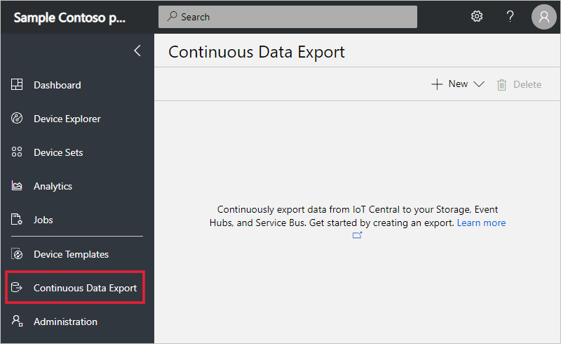
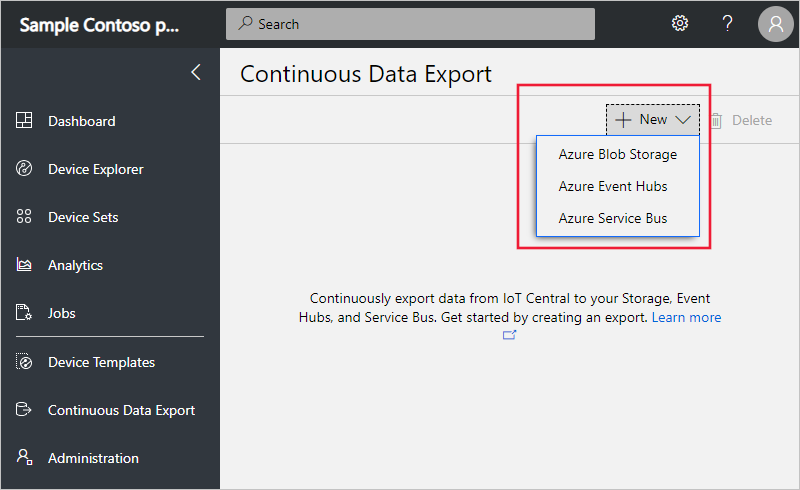
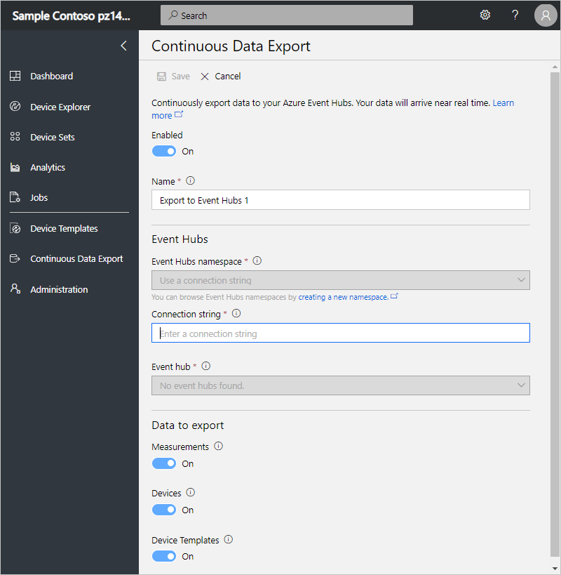
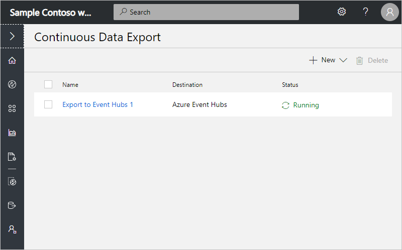

## Set up continuous data export

Now that you have a Storage/Event Hubs/Service Bus destination to export data to, follow these steps to set up continuous data export. 

1. Sign in to your IoT Central application.

2. In the left menu, select **Continuous Data Export**.

    > [!Note]
    > If you don't see Continuous Data Export in the left menu, you are not an administrator in your app. Talk to an administrator to set up data export.

    

3. Select the **+ New** button in the top right. Choose one of **Azure Blob Storage**, **Azure Event Hubs**, or **Azure Service Bus** as the destination of your export. 

    > [!NOTE] 
    > The maximum number of exports per app is five. 

    

4. In the drop-down list box, select your **Storage Account/Event Hubs namespace/Service Bus namespace**. You can also pick the last option in the list which is **Enter a connection string**. 

    > [!NOTE] 
    > You will only see Storage Accounts/Event Hubs namespaces/Service Bus namespaces in the **same subscription as your IoT Central app**. If you want to export to a destination outside of this subscription, choose **Enter a connection string** and see step 5.

    > [!NOTE] 
    > For 7 day trial apps, the only way to configure continuous data export is through a connection string. This is because 7 day trial apps do not have an associated Azure subscription.

    

5. (Optional) If you chose **Enter a connection string**, a new box appears for you to paste your connection string. To get the connection string for your:
    - Storage account, go to the Storage account in the Azure Portal.
        - Under **Settings**, select **Access keys**
        - Copy either the key1 Connection string or the key2 Connection string
    - Event Hubs or Service Bus, go to the namespace in the Azure Portal.
        - Under **Settings**, select **Shared Access Policies**
        - Choose the default **RootManageSharedAccessKey** or create a new one
        - Copy either the primary or secondary connection string
 
6. Choose a Container/Event hub/Queue or Topic from the drop-down list box.

7. Under **Data to export**, specify each type of data to export by setting the type to **On**.

6. To turn on continuous data export, make sure **Data export** is **On**. Select **Save**.

  

7. After a few minutes, your data will appear in your chosen destination.
