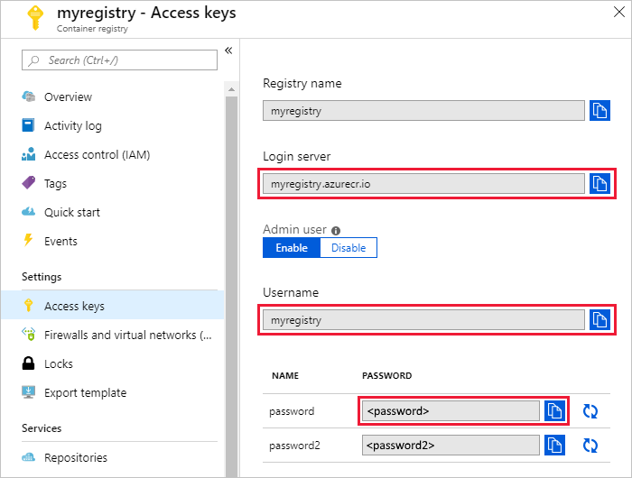

## Create a container registry

In this tutorial, you use the Azure IoT Tools extension to build a module and create a **container image** from the files. Then you push this image to a **registry** that stores and manages your images. Finally, you deploy your image from your registry to run on your IoT Edge device.

You can use any Docker-compatible registry to hold your container images. Two popular Docker registry services are [Azure Container Registry](https://docs.microsoft.com/azure/container-registry/) and [Docker Hub](https://docs.docker.com/docker-hub/repos/#viewing-repository-tags). This tutorial uses Azure Container Registry.

If you don't already have a container registry, follow these steps to create a new one in Azure:

1. In the [Azure portal](https://portal.azure.com), select **Create a resource** > **Containers** > **Container Registry**.

2. Provide the following values to create your container registry:

   | Field | Value |
   | ----- | ----- |
   | Subscription | Select a subscription from the drop-down list. |
   | Resource group | We recommend that you use the same resource group for all of the test resources that you create during the IoT Edge quickstarts and tutorials. For example, **IoTEdgeResources**. |
   | Registry name | Provide a unique name. |
   | Location | Choose a location close to you. |
   | SKU | Select **Basic**. |

3. Select **Create**.

4. After your container registry is created, browse to it, and from the left pane select **Access keys** from the menu located under **Settings**.

5. Set Admin user to Enable to view the **Username** and **Password**.

6. Copy the values for **Login server**, **Username**, and **Password** and save them somewhere convenient. You use these values throughout this tutorial to provide access to the container registry.

   