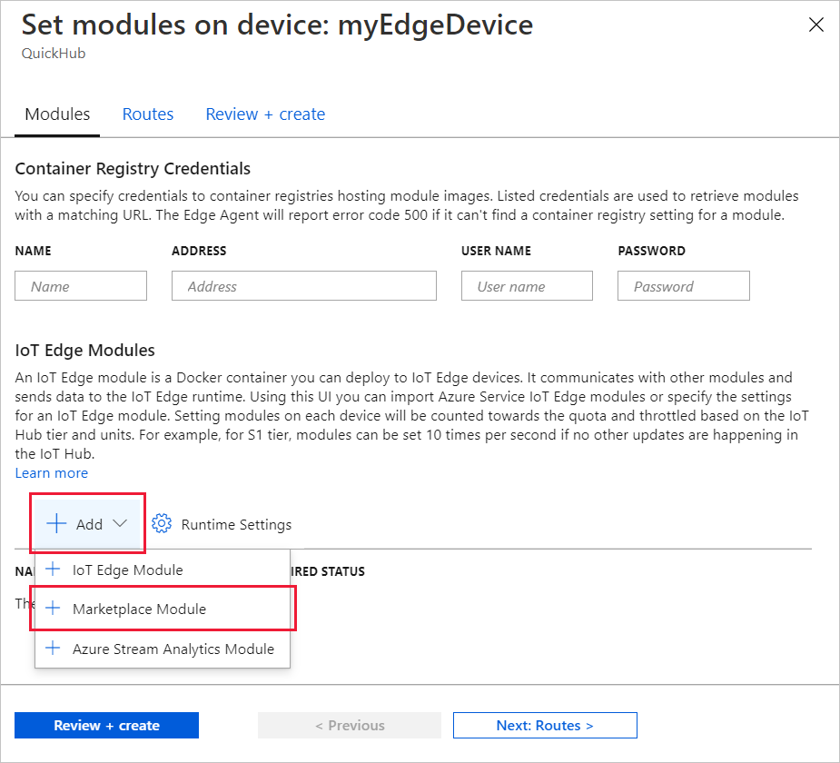
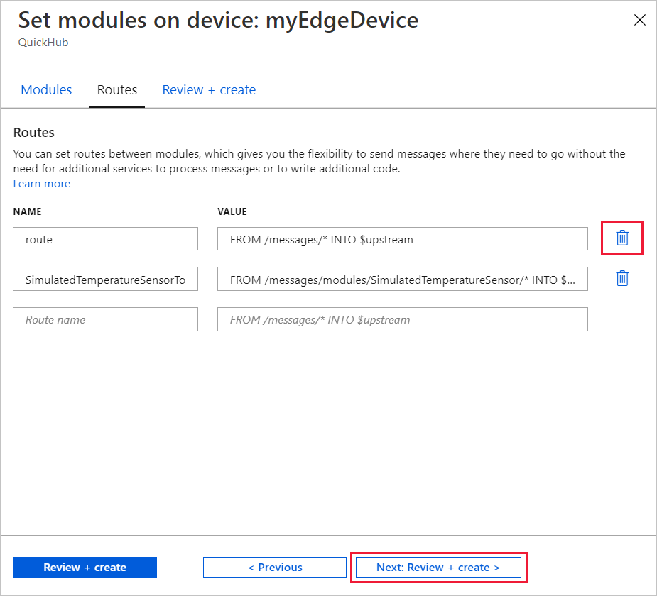

One of the key capabilities of Azure IoT Edge is being able to deploy code to your IoT Edge devices from the cloud. **IoT Edge modules** are executable packages implemented as containers. In this section, you deploy a pre-built module from the [IoT Edge Modules section of the Azure Marketplace](https://azuremarketplace.microsoft.com/marketplace/apps/category/internet-of-things?page=1&subcategories=iot-edge-modules) directly from your Azure IoT Hub.

The module that you deploy in this section simulates a sensor and sends generated data. This module is a useful piece of code when you're getting started with IoT Edge because you can use the simulated data for development and testing. If you want to see exactly what this module does, you can view the [simulated temperature sensor source code](https://github.com/Azure/iotedge/blob/027a509549a248647ed41ca7fe1dc508771c8123/edge-modules/SimulatedTemperatureSensor/src/Program.cs).

To deploy your first module from the Azure Marketplace, use the following steps:

1. Sign in to the [Azure portal](https://portal.azure.com) and navigate to your IoT hub.

1. From the menu on the left pane, under **Automatic Device Management**, select **IoT Edge**.

1. Click on the device ID of the target device from the list of devices.

1. On the upper bar, select **Set Modules**.

   

1. In the **IoT Edge Modules** section of the page, click **Add** and select **Marketplace Module** from the drop-down menu.

   

1. In the **IoT Edge Module Marketplace**, search for "Simulated Temperature Sensor" and select that module.

1. Notice that the SimulatedTemperatureSensor module is added to the IoT Edge Modules section, with the desired status **running**.

   Select **Next: Routes** to continue to the next step of the wizard.

   

1. On the **Routes** tab of the wizard, you can define how messages are passed between modules and the IoT Hub. Routes are constructed using name/value pairs. You should see two routes on this page. The default route called **route** sends all messages to IoT Hub (which is called `$upstream`). A second route called **SimulatedTemperatureSensorToIoTHub** sends all messages specifically from the simulated temperature module to IoT Hub. You can delete the default route because it's redundant in this case.

   Select **Next: Review + create** to continue to the next step of the wizard.

   

1. On the **Review + create** tab of the wizard, you can preview the JSON file that defines all the modules that get deployed to your IoT Edge device. Notice that the **SimulatedTemperatureSensor** module is included, and two additional system modules called **edgeAgent** and **edgeHub**. Select **Create** when you're done reviewing.

   When you submit a new deployment to an IoT Edge device, nothing is pushed to your device. Instead, the device queries IoT Hub regularly for any new instructions. If the device finds an updated deployment manifest, it uses the information about the new deployment to pull the module images from the cloud then starts running the modules locally. This process may take a few minutes.

1. After you create the module deployment details, the wizard returns you to the **IoT Edge** page of your IoT hub. Select your device from the list of IoT Edge devices to see its details.

1. On the device details page, scroll down to the **Modules** tab. Three modules should be listed: $edgeAgent, $edgeHub, and SimulatedTemperatureSensor. If one or more of the modules are listed as specified in deployment but not reported by device, your IoT Edge device is still starting them. Wait a few moments and select **Refresh** at the top of the page.

   
