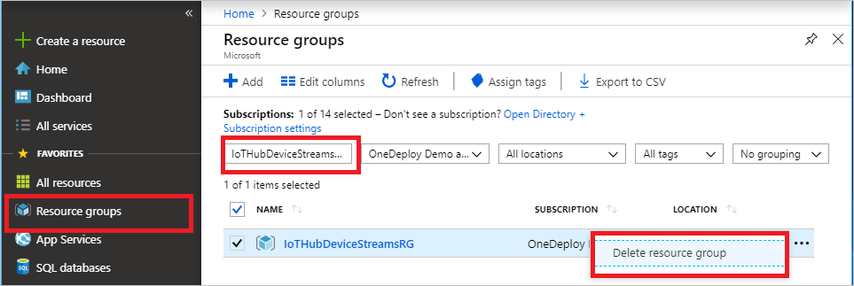

If you will be continuing to the next recommended article, you can keep the resources you've already created and reuse them.

Otherwise, you can delete the Azure resources created in this article to avoid charges. 

> [!IMPORTANT]
> Deleting a resource group is irreversible. The resource group and all the resources contained in it are permanently deleted. Make sure that you do not accidentally delete the wrong resource group or resources. If you created the IoT Hub inside an existing resource group that contains resources you want to keep, only delete the IoT Hub resource itself instead of deleting the resource group.
>

To delete a resource group by name:

1. Sign in to the [Azure portal](https://portal.azure.com) and click **Resource groups**.

2. In the **Filter by name...** textbox, type the name of the resource group containing your IoT Hub. 

3. To the right of your resource group in the result list, click **...** then **Delete resource group**.

    

4. You will be asked to confirm the deletion of the resource group. Type the name of your resource group again to confirm, and then click **Delete**. After a few moments, the resource group and all of its contained resources are deleted.