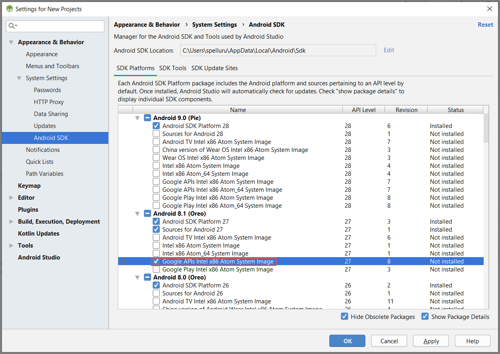
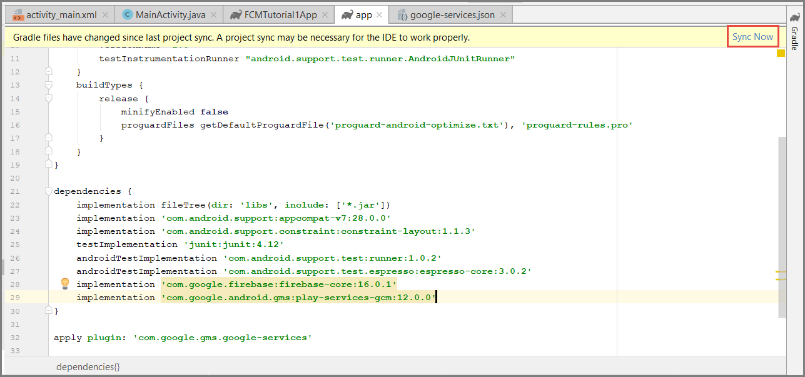

1. In **Android Studio**, select **Tools** on the menu, and select **SDK Manager**. 
2. Select the target version of the Android SDK that is used in your project, and select **Show Package Details**. 

    
3. Select **Google APIs**, if it is not already installed.

    
4. Switch to the **SDK Tools** tab. If you haven't already installed Google Play Service, select **Google Play Services** as shown in the following image. Then click **Apply** to install. Note the SDK path, for use in a later step.

    
3. Select **OK** on the **Confirm Change** dialog box. The Component Installer installs the requested components. Select **Finish** after the components are installed.
4. Select **OK** to close the **Settings for New Projects** dialog box.  
5. Open the `build.gradle` file in the **app** directory, and add this line under `dependencies`. 

    ```text
    implementation 'com.google.android.gms:play-services-gcm:16.0.0'
    ```
5. Select **Sync Now** icon in the tool bar.

    
1. Open **AndroidManifest.xml** and add this tag to the *application* tag.

    ```xml
    <meta-data android:name="com.google.android.gms.version"
         android:value="@integer/google_play_services_version" />
    ```
