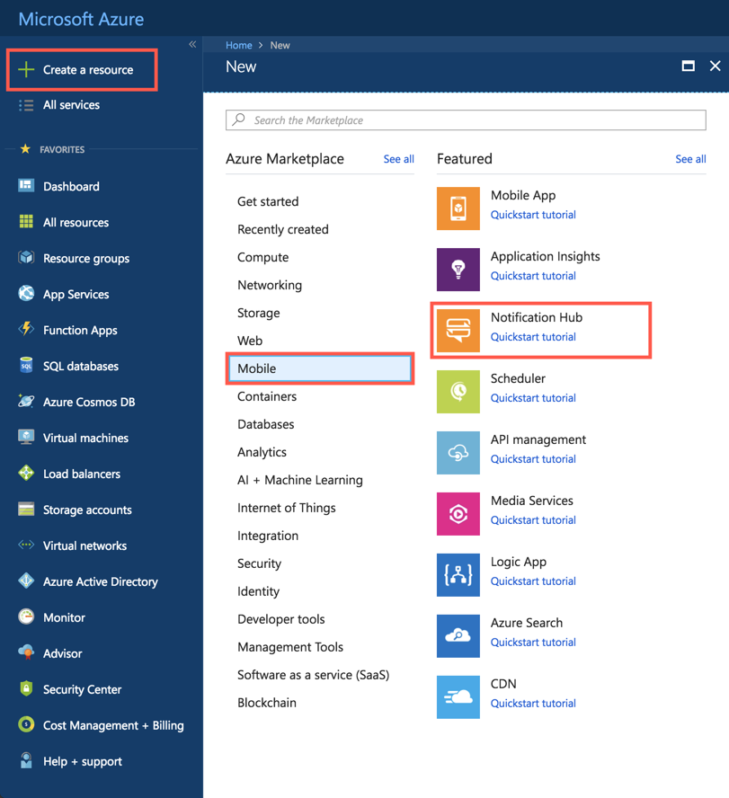

1. Sign in to the [Azure portal](https://portal.azure.com).

2. Select **New** > **Web + Mobile** > **Notification Hub**.
   
      
      
3. In the **Notification Hub** box, type a unique name. Select your **Region**, **Subscription**, and **Resource Group** (if you have one already). 
   
    If you already have a service bus namespace that you want to create the hub in, do the following:

    a. In the **Namespace** area, select the **Select Existing** link. 
   
    b. Select **Create**.

    If you don't already have a service bus namespace, you can use the default name, which is created based on the hub name (if the namespace name is available).
   
      

    After you've created the namespace and notification hub, open it by selecting **All resources** and then select the created notification hub from the list. 
   
      

4. Select **Access Policies**. Note the two connection strings that are available to you. You will need them to handle push notifications later.
   
      

