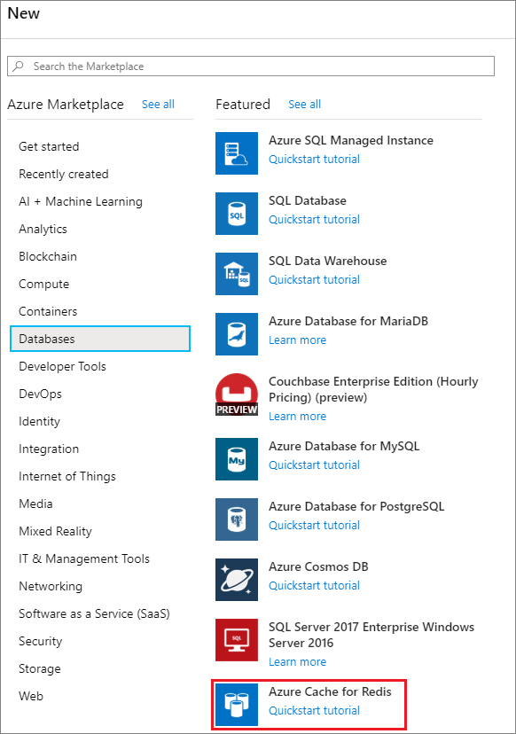

To create a cache, first sign in to the [Azure portal](https://portal.azure.com), and click **Create a resource** > **Databases** > **Redis Cache**.

In **New Redis Cache**, specify the desired configuration for the cache.

 

    | Setting      | Suggested value  | Description                                        |
    | ------------ |  ------- | -------------------------------------------------- |
    | **DNS name** | Globally unique name | The cache name must be a string between 1 and 63 characters and contain only numbers, letters, and the `-` character. The cache name cannot start or end with the `-` character, and consecutive `-` characters are not valid.  | 
    | **Subscription** | Your subscription | The subscription under which this new Azure Redis Cache is created. | 
    | **[Resource Group](../articles/azure-resource-manager/resource-group-overview.md)** |  myResourceGroup | Name for the new resource group in which to create your cache. | 
    | **Location** | East US | Choose a [region](https://azure.microsoft.com/regions/) near you or near other services that will use your cache. |
    | **[Pricing tier](https://azure.microsoft.com/pricing/details/cache/)** |  Basic C0 (250 MB Cache) |  Select the desired cache based on the size and features you require. Microsoft Azure Redis Cache is available in the following tiers:

        * **Basic** – Single node. Multiple sizes up to 53 GB.
        * **Standard** – Two-node Primary/Replica. Multiple sizes up to 53 GB. 99.9% SLA.
        * **Premium** – Enterprise ready, Two-node Primary/Replica with up to 10 shards. Multiple sizes from 6 GB to 530 GB. All Standard tier features and more. 
    |
    | **Pin to dashboard** |  Selected | Click pin the new cache to your dashboard making it easy to find. |

Once the new cache options are configured, click **Create**. It can take a few minutes for the cache to be created. To check the status, you can monitor the progress on the dashboard. After the cache has been created, your new cache has a **Running** status and is ready for use.

