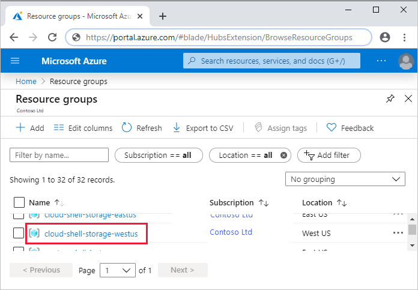

1. Sign in to the [Azure portal](https://portal.azure.com).

1. Select your Cloud Shell resource group. The name pattern is `cloud-shell-storage-<region>`.

   

1. Select the storage account for your Cloud Shell.

   :::image type="content" source="./media/resource-manager-cloud-shell-deploy/cloud-shell-storage.png" alt-text="Select storage account":::

1. Select **File Shares**.

   :::image type="content" source="./media/resource-manager-cloud-shell-deploy/files-shares.png" alt-text="Select file shares":::

1. Select the default file share for your cloud shell. The file share has the name format of `cs-<user>-<domain>-com-<uniqueGuid>`.

   :::image type="content" source="./media/resource-manager-cloud-shell-deploy/select-file-share.png" alt-text="Default file share":::

1. Add a new directory to hold your templates. Select that directory.

   :::image type="content" source="./media/resource-manager-cloud-shell-deploy/add-directory.png" alt-text="Add directory":::

1. Select the container you created.

   

1. Select **Upload**.

   

1. Find and upload your template.

   

1. After it has uploaded, select the template.

   

1. Copy the URL.

   

1. Open the prompt.

   
