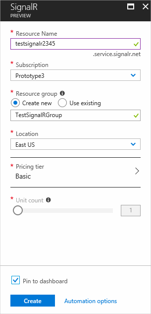

1. To create a new Azure SignalR Service resource, first sign in to the [Azure portal](https://portal.azure.com), and click **Create a resource**. In the *Search the Marketplace* textbox, type **SignalR Service** and press **enter**.

2. Click **SignalR Service** in the results and click **Create**.

3. In the new **SignalR** settings blade, add the following settings for your new SignalR resource:

    | Name | Recommended value | Description |
    | ---- | ----------------- | ----------- |
    | Resource Name | *TestSignalR* | Enter a unique resource name to use for the SignalR resource. The name must be a string between 1 and 63 characters and contain only numbers, letters, and the `-` character. The name cannot start or end with the `-` character, and consecutive `-` characters are not valid.|
    | Subscription | Choose your subscription |  Select the Azure subscription that you want to use to test SignalR. If your account has only one subscription, it is automatically selected and the **Subscription** drop-down isn't displayed.|
    | Resource group | Create a new resource group named *TestSignalRGroup*| Select or create a resource group for your SignalR resource. This is useful for grouping multiple resources that you may want to delete at the same time by deleting the resource group. For more information, see [Using Resource groups to manage your Azure resources](../articles/azure-resource-manager/resource-group-overview.md). |
    | Location | *East US* | Use **Location** to specify the geographic location in which your SignalR resource is hosted. For the best performance, Microsoft strongly recommends that you create the resource in the same region as other components of your application to improve performance. |
    | Pricing tier | *Basic* | Currently only **Basic** is available. |
    | Pin to dashboard | ✔ | Check this box to have the resource pinned to your dashboard making it easier to find. |

     
4. Click **Create**. The deployment may take a few minutes to complete.

5. Once the deployment is complete, click **keys** under settings. Copy your primary or secondary key connection string. You will use this later to configure your app to use the Azure SignalR Service resource.

    The connection string will have the following form:
    
        Endpoint=<service_endpoint>;AccessKey=<access_key>;
