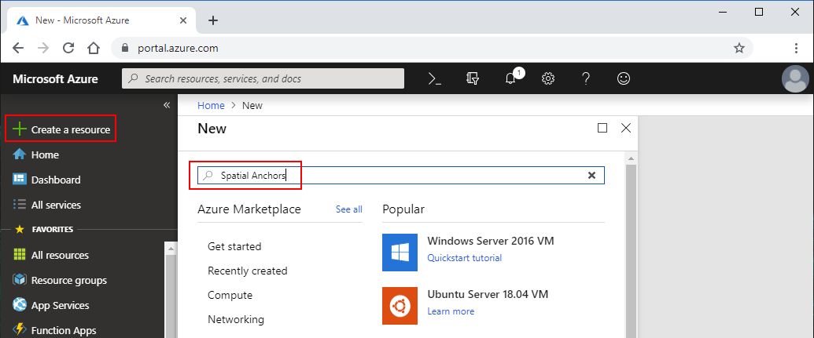

## Create a Spatial Anchors resource

1. Go to the <a href="https://portal.azure.com" target="_blank">Azure portal</a>.

2. In the left navigation pane in the Azure portal, select **Create a resource**.

3. Use the search box to search for **Spatial Anchors**.

   

4. Select **Spatial Anchors**. In the dialog box, select **Create**.

5. In the **Spatial Anchors Account** dialog box:

   1. Enter a unique resource name.
   2. Select the subscription that you want to attach the resource to.
   3. Create a resource group by selecting **Create new**. Name it **myResourceGroup** and select **OK**.
      [!INCLUDE [resource group intro text](resource-group.md)]
   4. Select a location (region) in which to place the resource.
   5. Select **New** to begin creating the resource.

   

6. After the resource is created, you can view the resource properties. Copy the resource's **Account ID** value into a text editor because you'll need it later.

   

7. Under **Settings**, select **Key**. Copy the **Primary key** value into a text editor. This value is the `Account Key`. You'll need it later.

   
