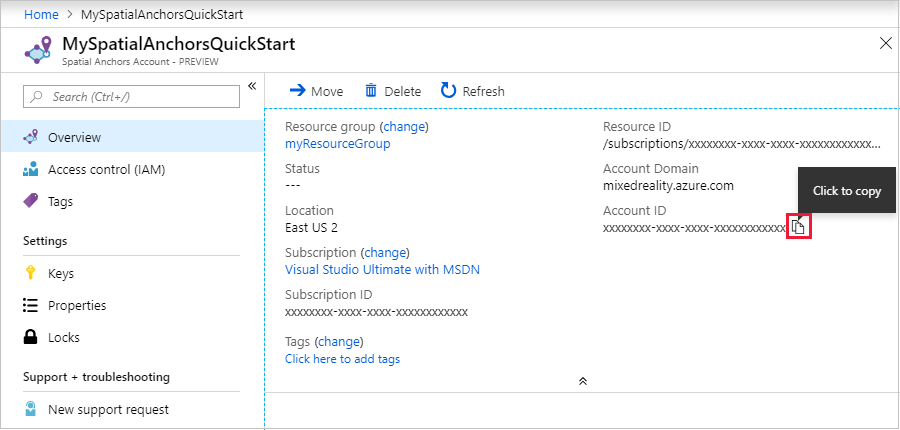
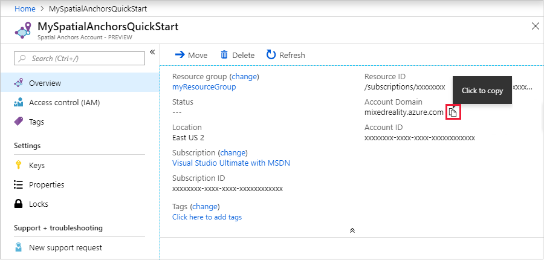
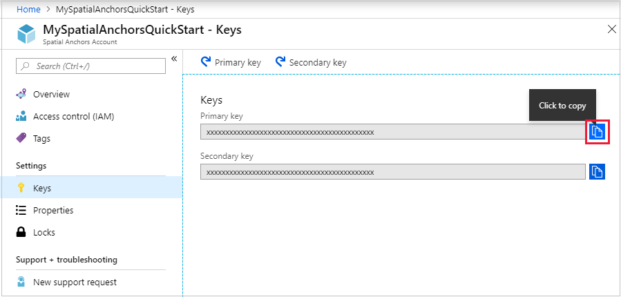

## Create a Spatial Anchors resource

1. Go to the <a href="https://portal.azure.com" target="_blank">Azure portal</a>.

1. On the left pane, select **Create a resource**.

1. Use the search box to search for **Spatial Anchors**.

   

1. Select **Spatial Anchors**, and then select **Create**.

1. On the **Spatial Anchors Account** pane, do the following:

   a. Enter a unique resource name, using regular alphanumeric characters.  
   b. Select the subscription that you want to attach the resource to.  
   c. Create a resource group by selecting **Create new**. Name it **myResourceGroup**, and then select **OK**.  
      [!INCLUDE [resource group intro text](resource-group.md)]  
   d. Select a location (region) in which to place the resource.  
   e. Select **New** to begin creating the resource.

   

   After the resource is created, Azure portal shows that your deployment is complete. 
   
   

1. Select **Go to resource**.

   You can now view the resource properties. 
   
1. Copy the resource's **Account ID** value into a text editor for later use.

   

1. Also copy the resource's **Account Domain** value into a text editor for later use.

   

1. Under **Settings**, select **Key**, and then copy the **Primary key** value, **Account Key**, into a text editor for later use.

   
