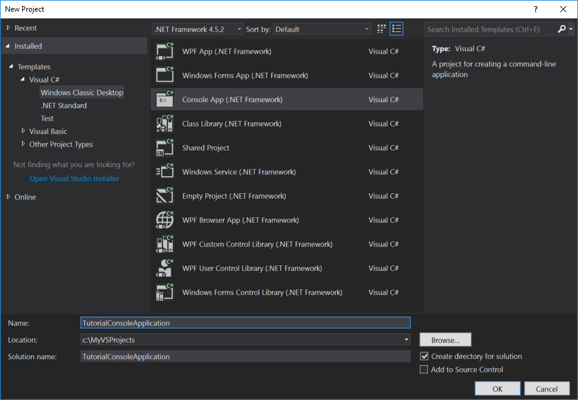

## Set up your development environment

Next, set up your development environment in Visual Studio so you're ready to try the code examples in this guide.

### Create a Windows console application project

In Visual Studio, create a new Windows console application. The following steps show you how to create a console application in Visual Studio 2017. The steps are similar in other versions of Visual Studio.

1. Select **File** > **New** > **Project**.
2. Select **Installed** > **Templates** > **Visual C#** > **Windows Classic Desktop**.
3. Select **Console App (.NET Framework)**.
4. In the **Name** field, enter a name for your application.
5. Select **OK**.



All code examples in this tutorial can be added to the **Main()** method of your console application's **Program.cs** file.

You can use the Azure Storage client libraries in any type of .NET application, including an Azure cloud service or web app, and desktop and mobile applications. In this guide, we use a console application for simplicity.

### Use NuGet to install the required packages

You need to reference the following two packages in your project to complete this tutorial:

* [Microsoft Azure Storage Common Client Library for .NET](https://www.nuget.org/packages/Microsoft.Azure.Storage.Common/): This package provides programmatic access to data resources in your storage account.
* [Microsoft Azure Configuration Manager library for .NET](https://www.nuget.org/packages/Microsoft.Azure.ConfigurationManager/): This package provides a class for parsing a connection string in a configuration file, regardless of where your application is running.

In addition to these packages, you will likely need other Azure Storage client packages. The following is a list of all the Azure Storage packages available on NuGet:

* [Microsoft Azure Storage Blobs Library for .NET](https://www.nuget.org/packages/Microsoft.Azure.Storage.Blob/): This client library enables working with the Microsoft Azure Storage Blob service for storing binary and text data.
* [Microsoft Azure Storage Files Library for .NET](https://www.nuget.org/packages/Microsoft.Azure.Storage.File/): This client library enables working with the Microsoft Azure Storage File service for storing binary and text data.
* [Microsoft Azure Storage Queues Library for .NET](https://www.nuget.org/packages/Microsoft.Azure.Storage.Queue/): This client library enables working with the Microsoft Azure Storage Queue service for storing messages that may be accessed by a client.

You can use NuGet to obtain these packages. Follow these steps:

1. Right-click your project in **Solution Explorer**, and choose **Manage NuGet Packages**.
2. Search online for "Microsoft.Azure.Storage", and select **Install** to install the Storage client libraries and their dependencies.
3. Search online for "Microsoft.Azure.ConfigurationManager", and select **Install** to install the Azure Configuration Manager.

> [!NOTE]
> The Storage client libraries packages are also included in the [Azure SDK for .NET](https://azure.microsoft.com/downloads/). However, we recommend that you also install the Storage client libraries from NuGet to ensure that you always have the latest versions.
>
> The ODataLib dependencies in the Storage client libraries for .NET are resolved by the ODataLib packages available on NuGet, not from WCF Data Services. The ODataLib libraries can be downloaded directly, or referenced by your code project through NuGet. The specific ODataLib packages used by the Storage client libraries are [OData](http://nuget.org/packages/Microsoft.Data.OData/), [Edm](http://nuget.org/packages/Microsoft.Data.Edm/), and [Spatial](http://nuget.org/packages/System.Spatial/). While these libraries are used by the Azure Table storage classes, they are required dependencies for programming with the Storage client libraries.

### Determine your target environment

You have two environment options for running the examples in this guide:

* You can run your code against an Azure Storage account in the cloud.
* You can run your code against the Azure storage emulator. The storage emulator is a local environment that emulates an Azure Storage account in the cloud. The emulator is a free option for testing and debugging your code while your application is under development. The emulator uses a well-known account and key. For more information, see [Use the Azure storage emulator for development and testing](../articles/storage/common/storage-use-emulator.md).

If you are targeting a storage account in the cloud, copy the primary access key for your storage account from the Azure portal. For more information, see [Access keys](../articles/storage/common/storage-account-manage.md#access-keys).

> [!NOTE]
> You can target the storage emulator to avoid incurring any costs associated with Azure Storage. However, if you do choose to target an Azure storage account in the cloud, costs for performing this tutorial will be negligible.

### Configure your storage connection string

The Azure Storage client libraries for .NET support using a storage connection string to configure endpoints and credentials for accessing storage services. The best way to maintain your storage connection string is in a configuration file.

For more information about connection strings, see [Configure a connection string to Azure Storage](../articles/storage/common/storage-configure-connection-string.md).

> [!NOTE]
> Your storage account key is similar to the root password for your storage account. Always be careful to protect your storage account key. Avoid distributing it to other users, hard-coding it, or saving it in a plain-text file that is accessible to others. Regenerate your key by using the Azure portal if you believe it may have been compromised.

To configure your connection string, open the **app.config** file from Solution Explorer in Visual Studio. Add the contents of the **\<appSettings\>** element shown below. Replace *account-name* with the name of your storage account, and *account-key* with your account access key:

```xml
<configuration>
    <startup>
        <supportedRuntime version="v4.0" sku=".NETFramework,Version=v4.5.2" />
    </startup>
    <appSettings>
        <add key="StorageConnectionString" value="DefaultEndpointsProtocol=https;AccountName=account-name;AccountKey=account-key" />
    </appSettings>
</configuration>
```

For example, your configuration setting appears similar to:

```xml
<add key="StorageConnectionString" value="DefaultEndpointsProtocol=https;AccountName=storagesample;AccountKey=GMuzNHjlB3S9itqZJHHCnRkrokLkcSyW7yK9BRbGp0ENePunLPwBgpxV1Z/pVo9zpem/2xSHXkMqTHHLcx8XRA==" />
```

To target the storage emulator, you can use a shortcut that maps to the well-known account name and key. In that case, your connection string setting is:

```xml
<add key="StorageConnectionString" value="UseDevelopmentStorage=true;" />
```
