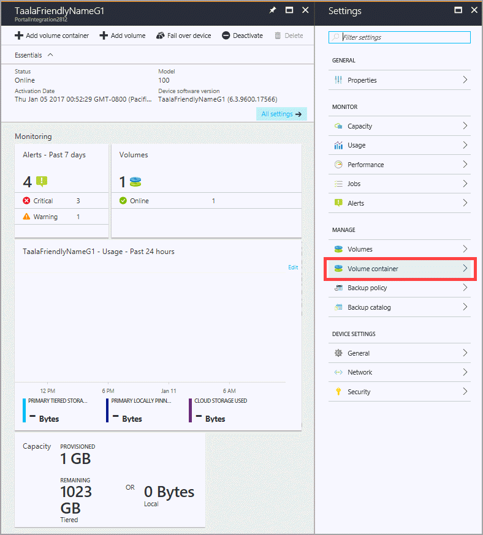
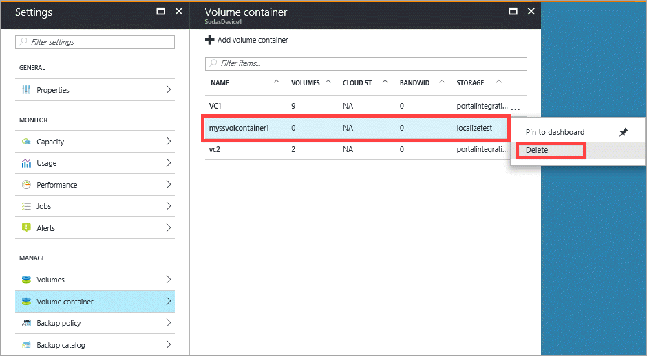
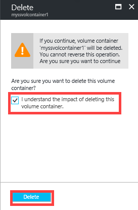
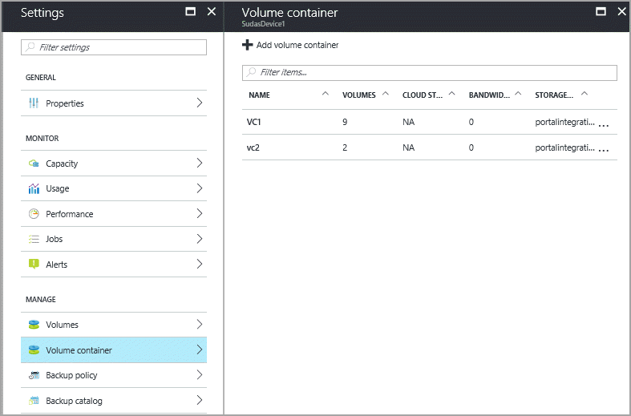

<!--author=alkohli last changed: 05/08/18-->

To delete a volume container, you must
 - delete volumes in the volume container. If the volume container has associated volumes, take those volumes offline first. Follow the steps in [Take a volume offline](../articles/storsimple/storsimple-8000-manage-volumes-u2.md#take-a-volume-offline). After the volumes are offline, you can delete them. 
 - delete associated backup policies and cloud snapshots. Check if the volume container has associated backup policies and cloud snapshots. If so, then [delete the backup policies](../articles/storsimple/storsimple-8000-manage-backup-policies-u2.md#delete-a-backup-policy). This will also delete the cloud snapshots. 
 
When the volume container has no associated volumes, backup policies, and cloud snapshots, you can delete it. Perform the following procedure to delete a volume container.

#### To delete a volume container
1. Go to your StorSimple Device Manager service and click **Devices**. Select and click the device and then go to **Settings > Manage > Volume containers**.

    

2. From the tabular list of volume containers, select the volume container you want to delete, right click **...** and then select **Delete**.

    

3. If a volume container has no associated volumes, backup policies, and cloud snapshots, then it can be deleted. When prompted for confirmation, review and select the checkbox stating the impact of deleting the volume container. Click **Delete** to then delete the volume container.

    

The list of volume containers is updated to reflect the deleted volume container.

