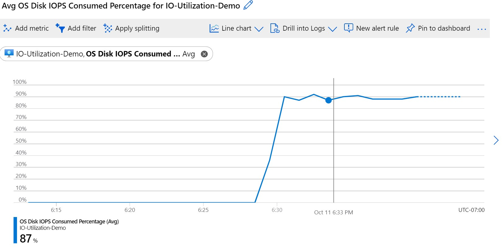
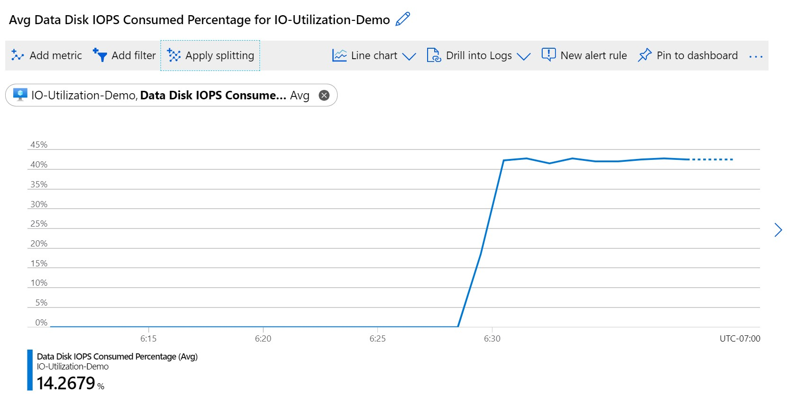
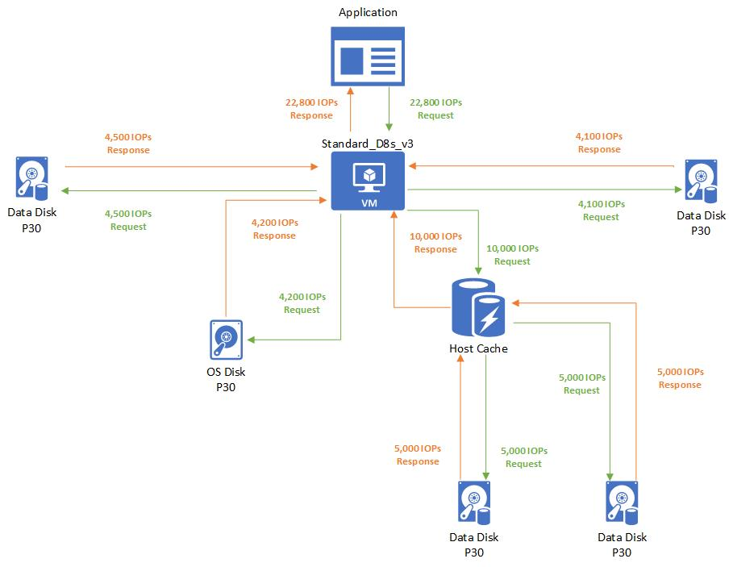

The Standard_D8s_v3 can achieve a total of 28,600 IOPS. Using the metrics, let's investigate what's going on and identify our storage IO bottleneck. On the left side pane, select **Metrics**:

Let's first take a look at our **VM Cached IOPS Consumed Percentage** metric:

This metric tells us that 61% of the 16,000 IOPS allotted to the cached IOPS on the VM is being used. This percentage means that the storage IO bottleneck isn't with the disks that are cached because it isn't at 100%. Now let's look at our **VM Uncached IOPS Consumed Percentage** metric:

This metric is at 100%. It tells us that all of the 12,800 IOPS allotted to the uncached IOPS on the VM are being used. One way we can remediate this issue is to change the size of our VM to a larger size that can handle the additional IO. But before we do that, let's look at the attached disk to find out how many IOPS they are seeing. Check the OS Disk by looking at the **OS Disk IOPS Consumed Percentage**:

This metric tells us that around 90% of the 5,000 IOPS provisioned for this P30 OS disk is being used. This percentage means there's no bottleneck at the OS Disk. Now let's check the data disks that are attached to the VM by looking at the **Data Disk IOPS Consumed Percentage**:

This metric tells us that the average IOPS consumed percentage across all the disks attached is around 42%. This percentage is calculated based on the IOPS that are used by the disks, and that aren't being served from the host cache. Let's drill deeper into this metric by applying *splitting* on these metrics and splitting by the LUN value:

This metric tells us the data disks attached on LUN 3 and 2 are using around 85% of their provisioned IOPS. Here is a diagram of what the IO looks like from the VM and Disks architecture:

