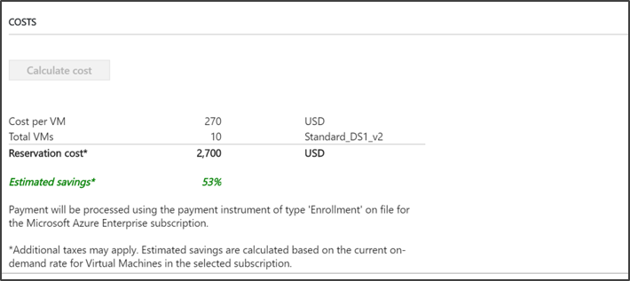
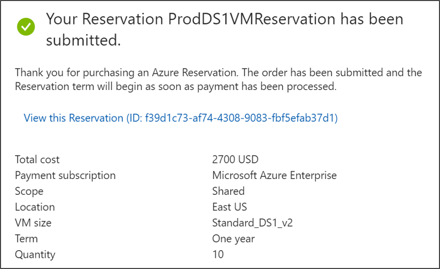

---
ms.topic: include
---
# Prepay for Virtual Machines with Reserved VM Instances

Prepay for virtual machines and save money with Reserved Virtual Machine Instances. For more information, see [Reserved Virtual Machine Instances offering](https://azure.microsoft.com/pricing/reserved-vm-instances/).

You can buy Reserved Virtual Machine Instances in the [Azure portal](https://portal.azure.com). To buy a Reserved Virtual Machine Instance:
-	You must be in an Owner role for at least one Enterprise or Pay-As-You-Go subscription.
-	For Enterprise subscriptions, reservation purchases must be enabled in the [EA portal](https://ea.azure.com).
-   For Cloud Solution Provider (CSP) program only the admin agents or sales agents can purchase the reservations.

[!IMPORTANT]
You must use one of the methods described below to correctly identify the VM size for a reservation purchase.

## Determine the right VM size before purchase
1. Refer to the AdditionalInfo field in your usage file or usage API to determine the correct VM size for a reservation purchase. Do not use the values from Meter Sub-category or Product fields since they do not differentiate between S and Non-S versions of a VM.
2. You can also get accurate VM size information using Powershell, Azure Resource Manager (ARM) or from VM details in the Azure portal.

## Buy a Reserved Virtual Machine Instance
1. Log in to the [Azure portal](https://portal.azure.com).
2. Select **All services** > **Reservations**.
3. Select **Add** to purchase a new reservation.
4. Fill in the required fields. Running VM instances that match the attributes you select qualify to get the reservation discount. The actual number of your VM instances that get the discount depend on the scope and quantity selected.

    | Field      | Description|
    |:------------|:--------------|
    |Name        |The name of this reservation.| 
    |Subscription|The subscription used to pay for the reservation. The payment method on the subscription is charged the upfront costs for the reservation. The subscription type must be an enterprise agreement (offer number: MS-AZR-0017P) or Pay-As-You-Go (offer number: MS-AZR-0003P). For an enterprise subscription, the charges are deducted from the enrollment's monetary commitment balance or charged as overage. For Pay-As-You-Go subscription, the charges are billed to the credit card or invoice payment method on the subscription.|    
    |Scope       |The reservation’s scope can cover one subscription or multiple subscriptions (shared scope). If you select: <ul><li>Single subscription - The reservation discount is applied to VMs in this subscription. </li><li>Shared - The reservation discount is applied to VMs running in any subscriptions within your billing context. For enterprise customers, the shared scope is the enrollment and includes all subscriptions (except dev/test subscriptions) within the enrollment. For Pay-As-You-Go customers, the shared scope is all Pay-As-You-Go subscriptions created by the account administrator.</li></ul>|
    |Location    |The Azure region that’s covered by the reservation.|    
    |VM Size     |The size of the VM instances.|
    |Term        |One year or three years.|
    |Quantity    |The number of instances being purchased within the reservation. The quantity is the number of running VM instances that can get the billing discount. For example, if you are running 10 Standard_D2 VMs in East US, then you would specify quantity as 10 to maximize the benefit for all running machines. |
5. You can view the cost of the reservation when you select **Calculate cost**.

    

6. Select **Purchase**.
7. Select **View this Reservation** to see the status of your purchase.

    

## Next steps 
The reservation discount is applied automatically to the number of running virtual machines that match the reservation scope and attributes. You can update the scope of the reservation through [Azure portal](https://portal.azure.com), PowerShell, CLI or through the API. 

To learn how to manage a reservation, see [Manage Azure Reserved Virtual Machine Instances](../articles/billing/billing-manage-reserved-vm-instance.md).

To learn more about Reserved Virtual Machine Instances, see the following articles.

- [Save money on virtual machines with Reserved Virtual Machine Instances](../articles/billing/billing-save-compute-costs-reservations.md)
- [Understand how the Reserved Virtual Machine Instance discount is applied](../articles/billing/billing-understand-vm-reservation-charges.md)
- [Understand Reserved Instance usage for your Pay-As-You-Go subscription](../articles/billing/billing-understand-reserved-instance-usage.md)
- [Understand Reserved Instance usage for your Enterprise enrollment](../articles/billing/billing-understand-reserved-instance-usage-ea.md)
- [Windows software costs not included with Reserved Instances](../articles/billing/billing-reserved-instance-windows-software-costs.md)
- [Reserved Instances in Partner Center Cloud Solution Provider (CSP) program](https://docs.microsoft.com/partner-center/azure-reservations)