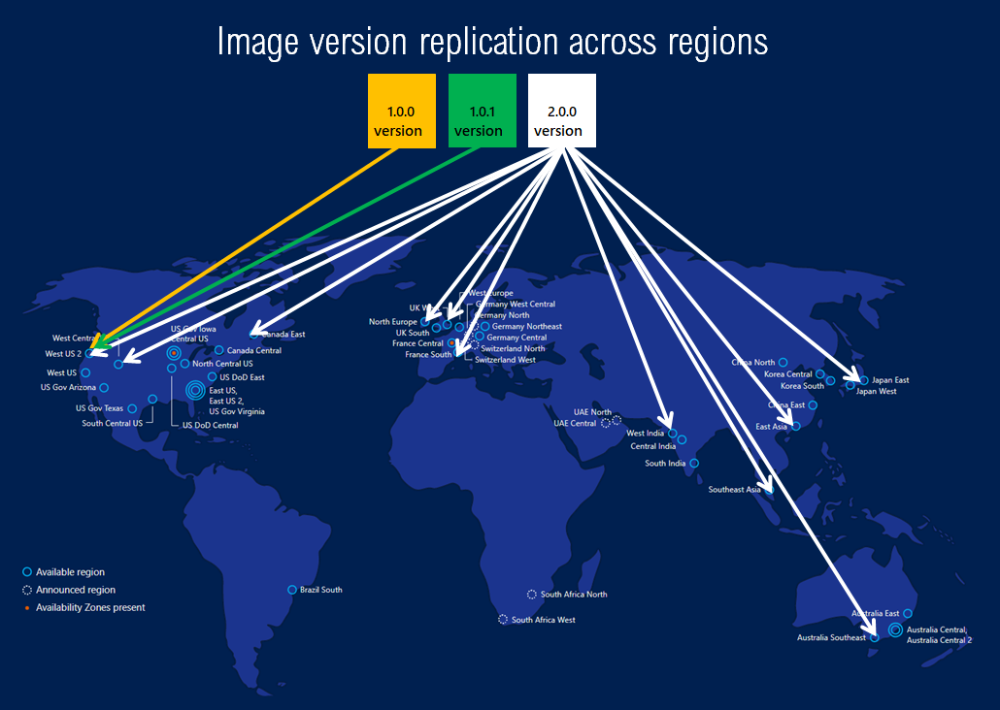

Shared Image Gallery is a service that helps you build structure and organization around your custom VM images. Shared Image Gallery provides three main value propositions
- Simple management
- Scale your customer images
- Share your images - share your images to different users, service principals or AD groups within your organization as well as different regions using the multi-region replication

A managed image is a copy of either a full VM (including any attached data disks) or just the OS disk, depending on how you create the image. When you create a VM  from the image, the copy of the VHDs in the image are used to create the disks for the new VM. The managed image remains in storage and can be used over and over again to create new VMs.

If you have a large number of managed images that you need to maintain and would like to make them available throughout your company, you can use a shared image gallery as a repository that makes it easy to update and share your images. The charges for using a shared image gallery are just the costs for the storage used by the images, plus any network egress costs for replicating images from the source region to the published regions.

Shared images encompasses multiple resources:

| Resource | Description|
|----------|------------|
| **Managed image** | This is a baseline image that can be used alone or used to create multiple **shared image versions** in an image gallery.|
| **Image gallery** | Like the public Azure Marketplace, an **image gallery** is a repository for managing and sharing images, but you control who has access within your company. |
| **Gallery image** | Images are defined within a gallery and carry information about the image and requirements for using it internally. This includes whether the image is Windows or Linux, release notes, and minumum and maximum memory requirements. This type of image is a resource within the resource manager deployment model, but it isn't used directly for creating VMs. It is a definition of a type of image. |
| **Shared image version** | An **image version** is what you use to create a VM when using a gallery. You can have multiple versions of an image as needed for your environment. Like a managed image, when you use an **image version** to create a VM, the image version is used to create new disks for the VM. Image versions can be used multiple times. |

### Regional Support

Regional support for shared image alleries is limited, but will expand over time. For preview: 

| Create Gallery In  | Replicate Version To |
|--------------------|----------------------|
| West Central US    |South Central US|
|                    |East US|
|                    |East US 2|
|                    |West US|
|                    |West US 2|
|                    |Central US|
|                    |North Central US|
|                    |Canada Central|
|                    |Canada East|
|                    |North Europe|
|                    |West Europe|
|                    |South India|
|                    |Southeast Asia|

## Scaling
Shared Image Gallery allows you to specify the number of replicas you want Azure to keep for the images. This helps in multi-VM/VMSS deployment scenarios as the VM deployments can be spread to different replicas reducing the chance of instance creation process being throttled due to overloading of a single replica.

## Replication
Shared Image Gallery also allows you to replicate your images to other Azure regions automatically. Each Shared Image Version can be replicated to different regions depending on what makes sense for your organization. One example is to always replicate the latest image in multi-regions while all older versions are only available in 1 region. This can help save on storage costs for Shared Image Versions. 
The regions a Shared Image Version is replicated to can be updated after creation time. The time it takes to replicate to different regions depends on the amount of data being copied and the number of regions the version is replicate to. This can take few hours in some cases. While the replication is happening, you can view the status of replication per region. Once the image replication is complete in a region, you can then deploy a VM or VMSS using that version in the region.

## Access
As the Shared Image Gallery, Shared Image and Shared Image Version are ARM resources, they can be shared using the built-in native Azure RBAC controls. Using RBAC you can share these resources to other users, service principals and groups in your organization. The scope of sharing these resources is within the same AD tenant. Once a user has access to the Shared Image Version, they can deploy a VM or a VMSS in any of the subscriptions they have access to within the same AD tenant as the Shared Image Version.  Here is the sharing matrix that helps understand what the user gets access to

|                      |                      | User has access to: |                      |
|----------------------|----------------------|--------------|----------------------|
| Shared with User                       | Shared Image Gallery | Shared Image | Shared Image Version |
|----------------------|----------------------|--------------|----------------------|
| Shared Image Gallery | Yes                  | Yes          | Yes                  |
| Shared Image         | No                   | Yes          | Yes                  |
| Shared Image Version | No                   | No           | Yes                  |

## Billing
There is no extra charge for using the Shared Image Gallery service. You will be charged for the following resources:
- Storage costs of storing the Shared Image Versions. This depends on the number of replicas of the version and the number of regions the version is replicated to.
- Network egress charges for replication from source region of the version to the replicated regions.
