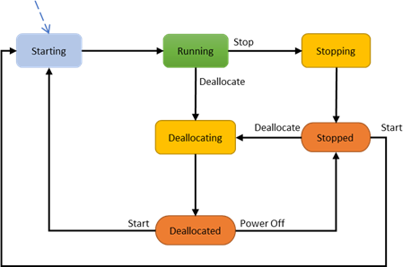

Virtual machines go through different states that can be categorized into *provisioning* and *power* states. The purpose of this article is to describe these states and specifically highlight when customers are billed for hardware and software usage. 

## Power States

The power state represents the last known state of a VM.

<table>
<th>
<td>

<b>State</b>

</td>
<td>

<b>Description</b>

</td>
<td>

<b>Billing</b>

</td>
</th>
<tr>
<td>

<b>Starting</b>

</td>
<td>

VM is starting up.

<code>"statuses": [ 
   { 
      "code": "PowerState/starting", 
       "level": "Info", 
        "displayStatus": "VM starting" 
    } 
    ]</code> 
</td>
<td>

<b>Not Billed</b>

</td>
</tr>
<tr>
<td>

<b>Running</b>

</td>
<td>

Normal working state for a VM

<code>"statuses": [ 
 { 
 "code": "PowerState/running", 
 "level": "Info", 
 "displayStatus": "VM running" 
 } 
 ]</code> 
</td>
<td>

<b>Billed (Hardware + Software) </b>

</td>
</tr>
<tr>
<td>

<b>Stopping</b>

</td>
<td>

This is a transitional state. When completed, it will show as **Stopped**.

<code>"statuses": [ 
 { 
 "code": "PowerState/stopping", 
 "level": "Info", 
 "displayStatus": "VM stopping" 
 } 
 ]</code> 
</td>
<td>

<b>Billed (Hardware + Software)</b>

</td>
</tr>
<tr>
<td>

<b>Stopped</b>

</td>
<td>

The VM has been shut down from within the guest OS or using the PowerOff APIs.

Hardware is still allocated to the VM and it remains on the host. 

<code>"statuses": [ 
 { 
 "code": "PowerState/stopped", 
 "level": "Info", 
 "displayStatus": "VM stopped" 
 } 
 ]</code> 
</td>
<td>

<b>Billed (Hardware only)</b>

</td>
</tr>
<tr>
<td>

<b>Deallocating</b>

</td>
<td>

Transitional state. WHen completed, the VM will show as **Deallocated**.

<code>"statuses": [ 
 { 
 "code": "PowerState/deallocating", 
 "level": "Info", 
 "displayStatus": "VM deallocating" 
 } 
 ]</code> 
</td>
<td>

<b>Billed (Hardware only)</b>

</td>
</tr>
<tr>
<td>

<b>Deallocated</b>

</td>
<td>

The VM has been stopped successfully and removed from the host. 

<code>"statuses": [ 
 { 
 "code": "PowerState/deallocated", 
 "level": "Info", 
 "displayStatus": "VM deallocated" 
 } 
 ]</code> 
</td>
<td>

<b>Not billed </b>

</td>
</tr>
</tbody>
</table>

## Provisioning states

A provisioning state is the status of a user-initiated (control plane) operation on the VM. These states are separate from the power state of a VM.

- **Create** – VM creation.

- **Update** – update model for an existing VM. Some non-model changes to VM such as Start/Restart also fall under update.

- **Delete** – VM deletion.

- **Deallocate** – is where a VM is stopped and removed from the host. Deallocating a VM results into Update of the VM model hence resulting into provisioning states related to updating.

Here are the **Operation states**. These are transitional states after the platform has
accepted a user-initiated action.

<table>
<tbody>
<tr>
<td width="162">

<b>States</b>

</td>
<td width="366">

Description

</td>
</tr>
<tr>
<td width="162">

<b>Creating</b>

</td>
<td width="366">
<code>"statuses": [ 
 { 
 "code": "ProvisioningState/creating", 
 "level": "Info", 
 "displayStatus": "Creating" 
 }</code> 
</td>
</tr>
<tr>
<td width="162">

<b>Updating</b>

</td>
<td width="366">
<code>"statuses": [ 
 { 
 "code": "ProvisioningState/updating", 
 "level": "Info", 
 "displayStatus": "Updating" 
 } 
 ]</code> 
</td>
</tr>
<tr>
<td width="162">

<b>Deleting</b>

</td>
<td width="366">
<code>"statuses": [ 
 { 
 "code": "ProvisioningState/deleting", 
 "level": "Info", 
 "displayStatus": "Deleting" 
 } 
 ]</code> 
</td>
</tr>
<tr>
<td width="162">

<b>OS provisioning states</b>

</td>
<td width="366">

If a VM is created with an OS image and not with a specialized image, then following sub-states can be observed:

1. <b>OSProvisioningInprogress</b> &ndash; The VM is running, and installation of guest OS is in progress. 
 
<code> "statuses": [ 
 { 
 "code": "ProvisioningState/creating/OSProvisioningInprogress", 
 "level": "Info", 
 "displayStatus": "OS Provisioning In progress" 
 } 
]</code> 

2. <b>OSProvisioningComplete</b> &ndash; Short-lived state. The VM quickly transitions to **Success** unless any extensions need to be installed. Installing extensions can take time.  
<code> "statuses": [ 
 { 
 "code": "ProvisioningState/creating/OSProvisioningComplete", 
 "level": "Info", 
 "displayStatus": "OS Provisioning Complete" 
 } 
]</code> 

<b>Note</b>: OS Provisioning can transition to **Failed** if there is an OS failure or the OS doesn't install in time. Customers will be billed for the deployed VM on the infrastructure.

 **Succeeded** – the user-initiated actions have
completed.

<code>
 "statuses": \[  
 { 
     "code": "ProvisioningState/succeeded", 
     "level": "Info", 
     "displayStatus": "Provisioning succeeded", 
     "time": "time" 
 } 
 \] 
</code>

**Failed** – represents a failed operation. Refer to the error codes to get more information and possible
solutions.

<code>
 "statuses": [ 
    { 
      "code": "ProvisioningState/failed/InternalOperationError", 
      "level": "Error", 
      "displayStatus": "Provisioning failed", 
      "message": "Operation abandoned due to internal error. Please try again later.", 
      "time": "time" 
    } 
</code>

 **Edge cases**: If a VM was running and in a good state, a
failed management operation will typically leave the VM in the **Running* state, which might be different from the latest state information received. To resolve this, look at the error message (either from the last failed operation or the VM instance view). If the error is because of API input validation, then try to fix the inputs. If the error, is due to Azure internal errors, retrying the management operation should resolve the issue. 

</td>
</tr>
</table>

## VM instance view

The instance view API provides VM running-state information. For more information, see the [Virtual Machines - Instance View](https://docs.microsoft.com/rest/api/compute/virtualmachines/instanceview) API documentation.

Azure Resources explorer provides a simple UI for viewing the VM running state: [Resource Explorer] (https://resources.azure.com/).

Provisioning states are visible on VM properties and instance view. Power states are available in instance view of VM. 

