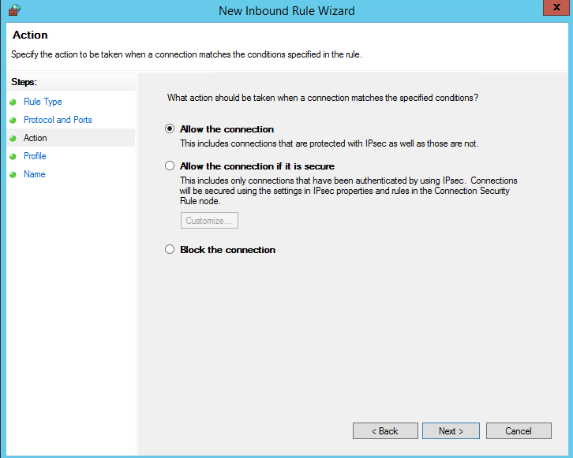
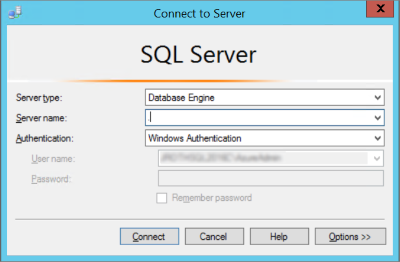
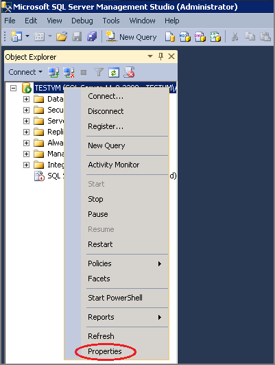
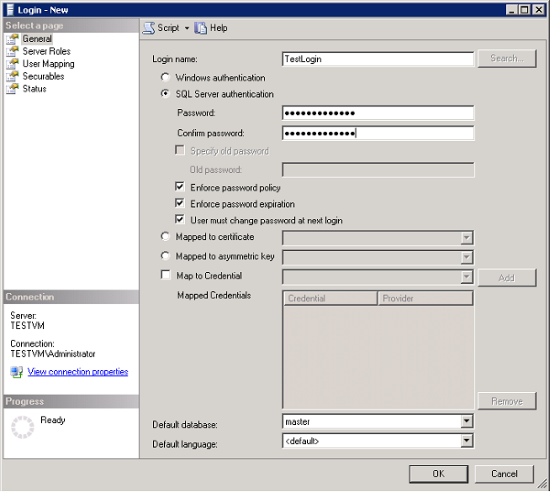

### Open TCP ports in the Windows firewall for the default instance of the Database Engine
1. Connect to the virtual machine with Remote Desktop. For detailed instructions on connecting to the VM, see [Open a SQL VM with Remote Desktop](../articles/virtual-machines/windows/sql/virtual-machines-windows-portal-sql-server-provision.md#remotedesktop).
2. Once signed in, at the Start screen, type **WF.msc**, and then hit ENTER.
   
    
3. In the **Windows Firewall with Advanced Security**, in the left pane, right-click **Inbound Rules**, and then click **New Rule** in the action pane.
   
    
4. In the **New Inbound Rule Wizard** dialog box, under **Rule Type**, select **Port**, and then click **Next**.
5. In the **Protocol and Ports** dialog, use the default **TCP**. In the **Specific local ports** box, then type the port number of the instance of the Database Engine (**1433** for the default instance or your choice for the private port in the endpoint step).
   
    
6. Click **Next**.
7. In the **Action** dialog box, select **Allow the connection**, and then click **Next**.
   
    **Security Note:** Selecting **Allow the connection if it is secure** can provide additional security. Select this option if you want to configure additional security options in your environment.
   
    
8. In the **Profile** dialog box, select **Public**, **Private**, and **Domain**. Then click **Next**.
   
    **Security Note:**  Selecting **Public** allows access over the internet. Whenever possible, select a more restrictive profile.
   
    
9. In the **Name** dialog box, type a name and description for this rule, and then click **Finish**.
   
    

Open additional ports for other components as needed. For more information, see [Configuring the Windows Firewall to Allow SQL Server Access](https://msdn.microsoft.com/library/cc646023.aspx).

### Configure SQL Server to listen on the TCP protocol

[!INCLUDE [Enable TCP](virtual-machines-sql-server-connection-tcp-protocol.md)]

### Configure SQL Server for mixed mode authentication
The SQL Server Database Engine cannot use Windows Authentication without domain environment. To connect to the Database Engine from another computer, configure SQL Server for mixed mode authentication. Mixed mode authentication allows both SQL Server Authentication and Windows Authentication.

> [!NOTE]
> Configuring mixed mode authentication might not be necessary if you have configured an Azure Virtual Network with a configured domain environment.
> 
> 

1. While connected to the virtual machine, on the Start page, type **SQL Server Management Studio** and click the selected icon.
   
    The first time you open Management Studio it must create the users Management Studio environment. This may take a few moments.
2. Management Studio presents the **Connect to Server** dialog box. In the **Server name** box, type the name of the virtual machine to connect to the Database Engine  with the Object Explorer (Instead of the virtual machine name you can also use **(local)** or a single period as the **Server name**). Select **Windows Authentication**, and leave **your_VM_name\your_local_administrator** in the **User name** box. Click **Connect**.
   
    
3. In SQL Server Management Studio Object Explorer, right-click the name of the instance of SQL Server (the virtual machine name), and then click **Properties**.
   
    
4. On the **Security** page, under **Server authentication**, select **SQL Server and Windows Authentication mode**, and then click **OK**.
   
    
5. In the SQL Server Management Studio dialog box, click **OK** to acknowledge the requirement to restart SQL Server.
6. In Object Explorer, right-click your server, and then click **Restart**. (If SQL Server Agent is running, it must also be restarted.)
   
    
7. In the SQL Server Management Studio dialog box, click **Yes** to agree that you want to restart SQL Server.

### Create SQL Server authentication logins
To connect to the Database Engine from another computer, you must create at least one SQL Server authentication login.

1. In SQL Server Management Studio Object Explorer, expand the folder of the server instance in which you want to create the new login.
2. Right-click the **Security** folder, point to **New**, and select **Login...**.
   
    
3. In the **Login - New** dialog box, on the **General** page, enter the name of the new user in the **Login name** box.
4. Select **SQL Server authentication**.
5. In the **Password** box, enter a password for the new user. Enter that password again into the **Confirm Password** box.
6. Select the password enforcement options required (**Enforce password policy**, **Enforce password expiration**, and **User must change password at next login**). If you are using this login for yourself, you do not need to require a password change at the next login.
7. From the **Default database** list, select a default database for the login. **master** is the default for this option. If you have not yet created a user database, leave this set to **master**.
   
    
8. If this is the first login you are creating, you may want to designate this login as a SQL Server administrator. If so, on the **Server Roles** page, check **sysadmin**.
   
   > [!NOTE]
   > Members of the sysadmin fixed server role have complete control of the Database Engine. You should carefully restrict membership in this role.
   > 
   > 
   
   
9. Click OK.

For more information about SQL Server logins, see [Create a Login](https://msdn.microsoft.com/library/aa337562.aspx).

