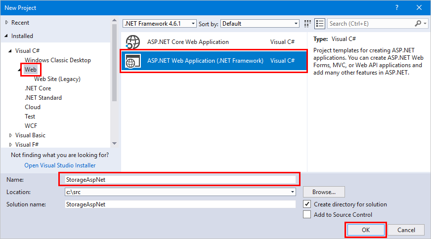

## Set up the development environment

This section walks through setting up the development environment. This includes creating an ASP.NET MVC app, adding a connected services connection, adding a controller, and specifying the required namespace directives.

### Create an ASP.NET MVC app project

1. Open Visual Studio.

1. From the main menu, select **File** > **New** > **Project**.

1. In the **New Project** dialog box, select **Web** > **ASP.NET Web Application (.NET Framework)**. In the **Name** field, specify **StorageAspNet**. Select **OK**.

	

1. In the **New ASP.NET Web Application** dialog box, select **MVC**, and then select **OK**.

	

### Use connected services to connect to an Azure storage account

1. In **Solution Explorer**, right-click the project.

1. From the context menu, select **Add** > **Connected Service**.

1. In the **Connected Services** dialog box, select **Cloud Storage with Azure Storage**.

	

1. In the **Azure Storage** dialog box, select the Azure storage account to be used for this tutorial. To create a new Azure storage account, select **Create a New Storage Account**, and complete the form. After selecting either an existing storage account or creating a new one, select **Add**. Visual Studio installs the NuGet package for Azure Storage and a storage connection string to **Web.config**.

1. In **Solution Explorer**, right-click on **Dependencies**, choose **Manage NuGet Packages**, and add a NuGet package reference to Microsoft.Azure.ConfigurationManager. Add the latest version.

> [!TIP]
> To learn how to create a storage account with the [Azure portal](https://portal.azure.com), see [Create a storage account](https://docs.microsoft.com/azure/storage/common/storage-quickstart-create-account).
>
> You can also create a storage account by using [Azure PowerShell](../articles/storage/common/storage-powershell-guide-full.md), [Azure CLI](../articles/storage/common/storage-azure-cli.md), or [Azure Cloud Shell](../articles/cloud-shell/overview.md).
