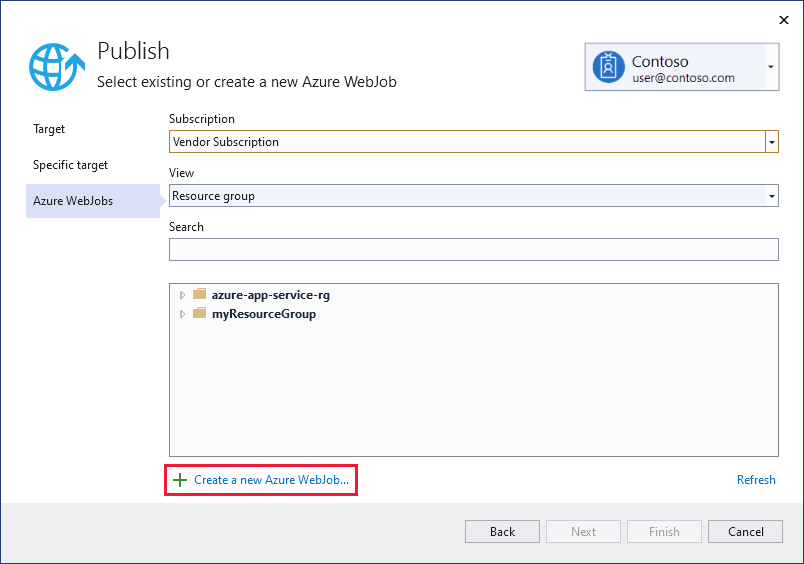

1. In **Solution Explorer**, right-click the project and select **Publish**.

1. In the **Publish** dialog box, select **Azure**, and then select **Next**. 

1. Select **Azure WebJobs**, and then select **Next**.

1. Select **Create a new Azure WebJob**.

   

1. In the **App Service (Windows)** dialog box, use the hosting settings in the following table.

    | Setting      | Suggested value  | Description                                |
    | ------------ |  ------- | -------------------------------------------------- |
    | **Name** | Globally unique name | Name that uniquely identifies your new function app. |
    | **Subscription** | Choose your subscription | The Azure subscription to use. |
    | **[Resource group](../articles/azure-resource-manager/management/overview.md)** | myResourceGroup |  Name of the resource group in which to create your function app. Choose **New** to create a new resource group.|
    | **[Hosting Plan](../articles/app-service/overview-hosting-plans.md)** | App Service plan | An [App Service plan](../articles/app-service/overview-hosting-plans.md) specifies the location, size, and features of the web server farm that hosts your app. You can save money when hosting multiple apps by configuring the web apps to share a single App Service plan. App Service plans define the region, instance size, scale count, and SKU (Free, Shared, Basic, Standard, or Premium). Choose **New** to create a new App Service plan. |

    

1. Select **Create** to create a WebJob and related resources in Azure with these settings and deploy your project code.